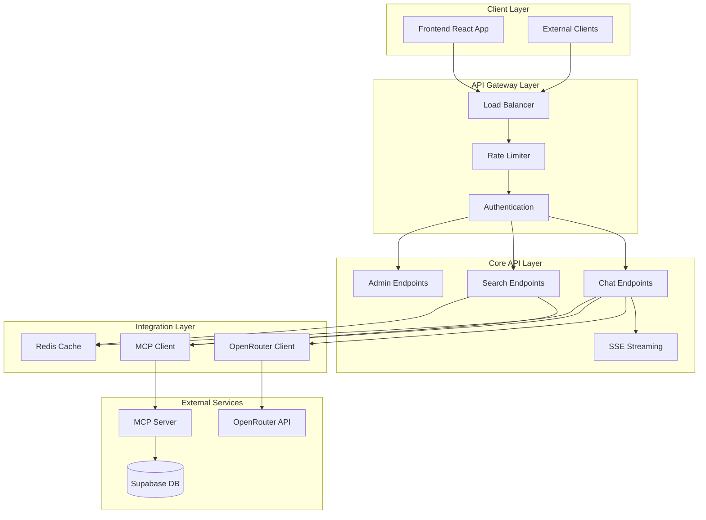

# API Design Specification

## Executive Summary

The Bill Bot API is designed as a RESTful service with real-time streaming capabilities, serving as the orchestration layer between the frontend and various backend services. The API emphasizes OpenRouter integration for LLM processing, MCP protocol communication for database operations, and Server-Sent Events for real-time response streaming. The design prioritizes security, performance, and extensibility while maintaining clear separation of concerns.

## API Architecture Overview

### Service Architecture



### Core Design Principles

- **RESTful Design**: Standard HTTP methods and status codes
- **Streaming Support**: Server-Sent Events for real-time responses
- **Error Consistency**: Uniform error response format across all endpoints
- **Rate Limiting**: Progressive rate limiting with clear feedback
- **Caching Strategy**: Intelligent caching for performance optimization
- **Security**: Comprehensive input validation and sanitization

## Core API Endpoints

### Chat Endpoints

#### Streaming Chat Session

```typescript
// POST /api/chat/stream
interface StreamChatRequest {
  message: string;
  sessionId?: string;
  connectionId: string;
  options?: {
    model?: string;
    temperature?: number;
    maxIterations?: number;
    searchFilters?: SearchFilters;
  };
}

interface StreamChatResponse {
  // Server-Sent Events stream
  // Content-Type: text/event-stream
}

// SSE Event Types
type SSEEvent = 
  | {
      type: 'start';
      data: {
        sessionId: string;
        messageId: string;
        timestamp: string;
      };
    }
  | {
      type: 'content';
      data: {
        content: string;
        messageId: string;
      };
    }
  | {
      type: 'tool_call';
      data: {
        id: string;
        name: string;
        arguments: Record<string, any>;
        status: 'started' | 'completed' | 'failed';
        result?: any;
        metadata?: {
          iteration?: number;
          searchType?: string;
          resultCount?: number;
          duration?: number;
        };
      };
    }
  | {
      type: 'citation';
      data: Citation;
    }
  | {
      type: 'error';
      data: {
        error: string;
        code: string;
        recoverable: boolean;
      };
    }
  | {
      type: 'end';
      data: {
        messageId: string;
        totalTokens?: number;
        cost?: number;
        duration: number;
        status: 'completed' | 'error' | 'stopped';
      };
    };
```

#### Stop Generation

```typescript
// POST /api/chat/stop
interface StopGenerationRequest {
  sessionId: string;
  connectionId: string;
}

interface StopGenerationResponse {
  success: boolean;
  message: string;
  stoppedAt: string;
}
```

### Search Endpoints

#### Direct Bill Search

```typescript
// GET /api/bills/search
interface BillSearchQuery {
  q: string;                    // Search query
  type?: 'semantic' | 'keyword' | 'hybrid';
  chamber?: 'house' | 'senate';
  status?: string[];
  congress?: number;
  sponsor?: string;
  dateFrom?: string;           // ISO date
  dateTo?: string;             // ISO date
  limit?: number;              // Max 100
  offset?: number;
  includeEmbeddings?: boolean;
  includeCitations?: boolean;
}

interface BillSearchResponse {
  data: {
    bills: Bill[];
    citations?: Citation[];
    metadata: {
      totalResults: number;
      searchTime: number;
      searchType: string;
      filters: SearchFilters;
      pagination: {
        limit: number;
        offset: number;
        hasMore: boolean;
      };
    };
  };
  success: true;
}
```

#### Bill Details

```typescript
// GET /api/bills/:billId
interface BillDetailsQuery {
  includeActions?: boolean;
  includeVotes?: boolean;
  includeAmendments?: boolean;
  includeRelated?: boolean;
}

interface BillDetailsResponse {
  data: {
    bill: Bill;
    actions?: LegislativeAction[];
    votes?: Vote[];
    amendments?: Amendment[];
    relatedBills?: Bill[];
    citations: Citation[];
  };
  success: true;
}
```

### Health and Status Endpoints

#### Health Check

```typescript
// GET /api/health
interface HealthResponse {
  status: 'healthy' | 'degraded' | 'unhealthy';
  timestamp: string;
  version: string;
  services: {
    database: ServiceStatus;
    openrouter: ServiceStatus;
    mcp: ServiceStatus;
    redis: ServiceStatus;
  };
  metrics: {
    uptime: number;
    memory: MemoryUsage;
    activeConnections: number;
    requestRate: number;
  };
}

interface ServiceStatus {
  status: 'up' | 'down' | 'degraded';
  responseTime?: number;
  lastCheck: string;
  error?: string;
}
```

#### System Metrics

```typescript
// GET /api/metrics (Admin only)
interface MetricsResponse {
  data: {
    api: {
      totalRequests: number;
      requestsPerMinute: number;
      errorRate: number;
      averageResponseTime: number;
    };
    chat: {
      activeSessions: number;
      totalMessages: number;
      averageIterations: number;
      streamingConnections: number;
    };
    search: {
      totalSearches: number;
      averageSearchTime: number;
      cacheHitRate: number;
      popularQueries: string[];
    };
    costs: {
      openrouterCost: number;
      cohereCost: number;
      totalCost: number;
      costPerRequest: number;
    };
  };
  success: true;
}
```

## API Implementation

### Express Server Setup

```typescript
// src/server.ts
import express from 'express';
import cors from 'cors';
import helmet from 'helmet';
import rateLimit from 'express-rate-limit';
import { createServer } from 'http';

class BillBotAPI {
  private app: express.Application;
  private server: any;
  private port: number;

  constructor() {
    this.app = express();
    this.port = parseInt(process.env.PORT || '3001');
    this.setupMiddleware();
    this.setupRoutes();
    this.setupErrorHandling();
  }

  private setupMiddleware(): void {
    // Security middleware
    this.app.use(helmet({
      contentSecurityPolicy: {
        directives: {
          defaultSrc: ["'self'"],
          connectSrc: ["'self'", process.env.FRONTEND_URL],
          imgSrc: ["'self'", "data:", "https:"],
        },
      },
      crossOriginEmbedderPolicy: false,
    }));

    // CORS configuration
    this.app.use(cors({
      origin: [
        process.env.FRONTEND_URL || 'http://localhost:3000',
        /^https:\/\/.*\.railway\.app$/,
      ],
      credentials: true,
      methods: ['GET', 'POST', 'PUT', 'DELETE', 'OPTIONS'],
      allowedHeaders: ['Content-Type', 'Authorization', 'X-Requested-With'],
    }));

    // Rate limiting
    const generalLimiter = rateLimit({
      windowMs: 15 * 60 * 1000, // 15 minutes
      max: 100, // limit each IP to 100 requests per windowMs
      message: {
        error: 'Too many requests from this IP',
        retryAfter: '15 minutes',
      },
      standardHeaders: true,
      legacyHeaders: false,
    });

    const chatLimiter = rateLimit({
      windowMs: 60 * 1000, // 1 minute
      max: 20, // limit each IP to 20 chat requests per minute
      message: {
        error: 'Too many chat requests',
        retryAfter: '1 minute',
      },
    });

    this.app.use('/api', generalLimiter);
    this.app.use('/api/chat', chatLimiter);

    // Body parsing
    this.app.use(express.json({ limit: '10mb' }));
    this.app.use(express.urlencoded({ extended: true, limit: '10mb' }));

    // Request logging
    this.app.use((req, res, next) => {
      const startTime = Date.now();
      
      res.on('finish', () => {
        const duration = Date.now() - startTime;
        console.log(`${req.method} ${req.path} - ${res.statusCode} - ${duration}ms`);
      });
      
      next();
    });
  }

  private setupRoutes(): void {
    // API routes
    this.app.use('/api/chat', chatRoutes);
    this.app.use('/api/bills', billRoutes);
    this.app.use('/api/health', healthRoutes);
    this.app.use('/api/admin', adminRoutes);

    // Root endpoint
    this.app.get('/', (req, res) => {
      res.json({
        name: 'Bill Bot API',
        version: process.env.npm_package_version || '1.0.0',
        status: 'running',
        docs: '/api/docs',
      });
    });

    // 404 handler
    this.app.use('*', (req, res) => {
      res.status(404).json({
        error: 'Endpoint not found',
        path: req.originalUrl,
        suggestion: 'Check API documentation at /api/docs',
      });
    });
  }

  private setupErrorHandling(): void {
    // Global error handler
    this.app.use((
      err: Error,
      req: express.Request,
      res: express.Response,
      next: express.NextFunction
    ) => {
      console.error('Unhandled error:', err);

      // Don't expose internal errors in production
      const isProduction = process.env.NODE_ENV === 'production';
      
      res.status(500).json({
        error: 'Internal server error',
        message: isProduction ? 'Something went wrong' : err.message,
        timestamp: new Date().toISOString(),
        requestId: req.headers['x-request-id'] || 'unknown',
      });
    });
  }

  public start(): void {
    this.server = createServer(this.app);
    
    this.server.listen(this.port, () => {
      console.log(`Bill Bot API running on port ${this.port}`);
      console.log(`Environment: ${process.env.NODE_ENV || 'development'}`);
    });

    // Graceful shutdown
    process.on('SIGTERM', () => {
      console.log('SIGTERM received, shutting down gracefully');
      this.server.close(() => {
        console.log('Server closed');
        process.exit(0);
      });
    });
  }
}

export default BillBotAPI;
```

### Chat Route Implementation

```typescript
// src/routes/chat.ts
import { Router, Request, Response } from 'express';
import { SSEStreamingService } from '../services/streamingService';
import { ChatOrchestrator } from '../services/chatOrchestrator';
import { validateChatRequest } from '../validators/chatValidator';

const router = Router();
const sseService = new SSEStreamingService();
const chatOrchestrator = new ChatOrchestrator();

// Streaming chat endpoint
router.post('/stream', async (req: Request, res: Response) => {
  try {
    // Validate request
    const validationResult = validateChatRequest(req.body);
    if (!validationResult.success) {
      return res.status(400).json({
        error: 'Invalid request',
        details: validationResult.errors,
      });
    }

    const { message, sessionId, connectionId, options } = req.body;

    // Create SSE connection
    const connectionIdToUse = connectionId || `conn_${Date.now()}_${Math.random().toString(36).substr(2, 9)}`;
    sseService.createConnection(connectionIdToUse, res);

    // Process chat request
    try {
      await chatOrchestrator.processChat({
        message,
        sessionId,
        connectionId: connectionIdToUse,
        options,
        streamingService: sseService,
      });
    } catch (error) {
      console.error('Chat processing error:', error);
      sseService.streamError(
        connectionIdToUse,
        error instanceof Error ? error.message : 'Unknown error occurred'
      );
    } finally {
      sseService.endStream(connectionIdToUse);
    }

  } catch (error) {
    console.error('Chat endpoint error:', error);
    
    if (!res.headersSent) {
      res.status(500).json({
        error: 'Failed to process chat request',
        message: error instanceof Error ? error.message : 'Unknown error',
      });
    }
  }
});

// Stop generation endpoint
router.post('/stop', async (req: Request, res: Response) => {
  try {
    const { sessionId, connectionId } = req.body;

    if (!connectionId) {
      return res.status(400).json({
        error: 'Connection ID required',
      });
    }

    // Stop the streaming connection
    sseService.closeConnection(connectionId);
    
    // Cancel any ongoing operations
    await chatOrchestrator.cancelSession(sessionId);

    res.json({
      success: true,
      message: 'Generation stopped',
      stoppedAt: new Date().toISOString(),
    });

  } catch (error) {
    console.error('Stop generation error:', error);
    res.status(500).json({
      error: 'Failed to stop generation',
      message: error instanceof Error ? error.message : 'Unknown error',
    });
  }
});

export default router;
```

### Chat Orchestrator Service

```typescript
// src/services/chatOrchestrator.ts
import { OpenRouterClient } from './openRouterClient';
import { MCPClient } from './mcpClient';
import { SSEStreamingService } from './streamingService';

interface ChatRequest {
  message: string;
  sessionId?: string;
  connectionId: string;
  options?: ChatOptions;
  streamingService: SSEStreamingService;
}

interface ChatOptions {
  model?: string;
  temperature?: number;
  maxIterations?: number;
  searchFilters?: SearchFilters;
}

class ChatOrchestrator {
  private openRouter: OpenRouterClient;
  private mcpClient: MCPClient;
  private activeSessions = new Map<string, AbortController>();

  constructor() {
    this.openRouter = new OpenRouterClient();
    this.mcpClient = new MCPClient();
  }

  async processChat(request: ChatRequest): Promise<void> {
    const { message, sessionId, connectionId, options, streamingService } = request;
    
    // Create abort controller for this session
    const abortController = new AbortController();
    if (sessionId) {
      this.activeSessions.set(sessionId, abortController);
    }

    try {
      // Send start event
      streamingService.streamToConnection(connectionId, {
        type: 'start',
        data: {
          sessionId: sessionId || 'anonymous',
          messageId: crypto.randomUUID(),
          timestamp: new Date().toISOString(),
        },
        timestamp: Date.now(),
      });

      // Initialize MCP client
      await this.mcpClient.initialize();

      // Prepare system prompt
      const systemPrompt = this.buildSystemPrompt(options);
      
      // Create tool-enabled completion
      const completion = await this.openRouter.createToolCompletion({
        model: options?.model || 'openai/gpt-4o',
        messages: [
          { role: 'system', content: systemPrompt },
          { role: 'user', content: message },
        ],
        tools: this.mcpClient.getAvailableTools(),
        temperature: options?.temperature || 0.7,
        stream: true,
        maxIterations: options?.maxIterations || 20,
      });

      // Process streaming response
      await this.processStreamingCompletion(
        completion,
        connectionId,
        streamingService,
        abortController.signal
      );

    } catch (error) {
      if (error.name === 'AbortError') {
        console.log('Chat session cancelled');
        return;
      }
      
      console.error('Chat orchestration error:', error);
      streamingService.streamError(
        connectionId,
        error instanceof Error ? error.message : 'Unknown error'
      );
    } finally {
      if (sessionId) {
        this.activeSessions.delete(sessionId);
      }
    }
  }

  private async processStreamingCompletion(
    completion: AsyncIterable<any>,
    connectionId: string,
    streamingService: SSEStreamingService,
    abortSignal: AbortSignal
  ): Promise<void> {
    for await (const chunk of completion) {
      if (abortSignal.aborted) {
        break;
      }

      if (chunk.choices[0]?.delta?.content) {
        // Stream content
        streamingService.streamContent(
          connectionId,
          chunk.choices[0].delta.content
        );
      }

      if (chunk.choices[0]?.delta?.tool_calls) {
        // Handle tool calls
        for (const toolCall of chunk.choices[0].delta.tool_calls) {
          await this.handleToolCall(
            toolCall,
            connectionId,
            streamingService
          );
        }
      }
    }
  }

  private async handleToolCall(
    toolCall: any,
    connectionId: string,
    streamingService: SSEStreamingService
  ): Promise<void> {
    const startTime = Date.now();
    
    try {
      // Stream tool call start
      streamingService.streamToConnection(connectionId, {
        type: 'tool_call',
        data: {
          id: toolCall.id,
          name: toolCall.function.name,
          arguments: JSON.parse(toolCall.function.arguments),
          status: 'started',
        },
        timestamp: Date.now(),
      });

      // Execute tool via MCP
      const result = await this.mcpClient.callTool(
        toolCall.function.name,
        JSON.parse(toolCall.function.arguments)
      );

      const duration = Date.now() - startTime;

      // Stream tool call completion
      streamingService.streamToConnection(connectionId, {
        type: 'tool_call',
        data: {
          id: toolCall.id,
          name: toolCall.function.name,
          arguments: JSON.parse(toolCall.function.arguments),
          status: 'completed',
          result,
          metadata: {
            duration,
            resultCount: result?.results?.length || 0,
          },
        },
        timestamp: Date.now(),
      });

      // Stream citations if available
      if (result?.citations) {
        for (const citation of result.citations) {
          streamingService.streamCitation(connectionId, citation);
        }
      }

    } catch (error) {
      console.error('Tool call error:', error);
      
      streamingService.streamToConnection(connectionId, {
        type: 'tool_call',
        data: {
          id: toolCall.id,
          name: toolCall.function.name,
          arguments: JSON.parse(toolCall.function.arguments),
          status: 'failed',
          error: error instanceof Error ? error.message : 'Unknown error',
        },
        timestamp: Date.now(),
      });
    }
  }

  private buildSystemPrompt(options?: ChatOptions): string {
    return `You are Bill Bot, an AI assistant specialized in helping users explore and understand legislative bills from the U.S. Congress.

Your capabilities include:
- Searching for bills by keyword, sponsor, topic, or status
- Providing detailed analysis of bill content and implications
- Explaining legislative processes and procedures
- Offering insights into bill progression and voting records

Guidelines:
- Always provide accurate, factual information based on search results
- Include proper citations for all information you reference
- Be clear about limitations and uncertainties in the data
- Use iterative search to find the most relevant and comprehensive information
- Provide context about legislative processes when helpful

Available tools allow you to search bills with up to ${options?.maxIterations || 20} iterations to find comprehensive information.`;
  }

  async cancelSession(sessionId?: string): Promise<void> {
    if (!sessionId) return;
    
    const abortController = this.activeSessions.get(sessionId);
    if (abortController) {
      abortController.abort();
      this.activeSessions.delete(sessionId);
    }
  }
}

export { ChatOrchestrator };
```

## Error Handling

### Standardized Error Responses

```typescript
// src/types/errors.ts
interface APIError {
  error: string;
  code?: string;
  message?: string;
  details?: any;
  timestamp: string;
  requestId?: string;
  recoverable?: boolean;
}

// Error response factory
class APIErrorFactory {
  static badRequest(message: string, details?: any): APIError {
    return {
      error: 'Bad Request',
      code: 'BAD_REQUEST',
      message,
      details,
      timestamp: new Date().toISOString(),
      recoverable: true,
    };
  }

  static unauthorized(message: string = 'Unauthorized'): APIError {
    return {
      error: 'Unauthorized',
      code: 'UNAUTHORIZED',
      message,
      timestamp: new Date().toISOString(),
      recoverable: false,
    };
  }

  static rateLimitExceeded(retryAfter: number): APIError {
    return {
      error: 'Rate Limit Exceeded',
      code: 'RATE_LIMIT_EXCEEDED',
      message: `Too many requests. Try again in ${retryAfter} seconds.`,
      details: { retryAfter },
      timestamp: new Date().toISOString(),
      recoverable: true,
    };
  }

  static internalError(message: string, details?: any): APIError {
    return {
      error: 'Internal Server Error',
      code: 'INTERNAL_ERROR',
      message: process.env.NODE_ENV === 'production' 
        ? 'An unexpected error occurred' 
        : message,
      details: process.env.NODE_ENV === 'production' ? undefined : details,
      timestamp: new Date().toISOString(),
      recoverable: false,
    };
  }

  static serviceUnavailable(service: string): APIError {
    return {
      error: 'Service Unavailable',
      code: 'SERVICE_UNAVAILABLE',
      message: `${service} is temporarily unavailable`,
      timestamp: new Date().toISOString(),
      recoverable: true,
    };
  }
}
```

### Request Validation

```typescript
// src/validators/chatValidator.ts
import Joi from 'joi';

const chatRequestSchema = Joi.object({
  message: Joi.string()
    .min(1)
    .max(2000)
    .required()
    .messages({
      'string.min': 'Message cannot be empty',
      'string.max': 'Message cannot exceed 2000 characters',
      'any.required': 'Message is required',
    }),
    
  sessionId: Joi.string()
    .pattern(/^[a-zA-Z0-9_-]+$/)
    .optional(),
    
  connectionId: Joi.string()
    .required()
    .messages({
      'any.required': 'Connection ID is required for streaming',
    }),
    
  options: Joi.object({
    model: Joi.string()
      .valid(
        'openai/gpt-4o',
        'openai/gpt-3.5-turbo',
        'anthropic/claude-3-sonnet',
        'anthropic/claude-3-haiku'
      )
      .optional(),
      
    temperature: Joi.number()
      .min(0)
      .max(2)
      .optional(),
      
    maxIterations: Joi.number()
      .min(1)
      .max(20)
      .optional(),
      
    searchFilters: Joi.object({
      chamber: Joi.string().valid('house', 'senate').optional(),
      status: Joi.array().items(Joi.string()).optional(),
      congress: Joi.number().min(100).optional(),
      dateFrom: Joi.date().iso().optional(),
      dateTo: Joi.date().iso().optional(),
    }).optional(),
  }).optional(),
});

export function validateChatRequest(data: any): {
  success: boolean;
  data?: any;
  errors?: string[];
} {
  const { error, value } = chatRequestSchema.validate(data, {
    abortEarly: false,
    stripUnknown: true,
  });

  if (error) {
    return {
      success: false,
      errors: error.details.map(detail => detail.message),
    };
  }

  return {
    success: true,
    data: value,
  };
}
```

## Performance Optimizations

### Response Caching

```typescript
// src/middleware/cache.ts
import Redis from 'ioredis';

class CacheMiddleware {
  private redis: Redis;

  constructor() {
    this.redis = new Redis(process.env.REDIS_URL || 'redis://localhost:6379');
  }

  // Cache middleware for search endpoints
  searchCache = (ttl: number = 300) => {
    return async (req: Request, res: Response, next: NextFunction) => {
      if (req.method !== 'GET') {
        return next();
      }

      const cacheKey = this.generateCacheKey(req);
      
      try {
        const cached = await this.redis.get(cacheKey);
        
        if (cached) {
          const data = JSON.parse(cached);
          res.set('X-Cache', 'HIT');
          res.set('X-Cache-TTL', await this.redis.ttl(cacheKey));
          return res.json(data);
        }
      } catch (error) {
        console.error('Cache retrieval error:', error);
      }

      // Intercept response to cache it
      const originalJson = res.json;
      res.json = function(data: any) {
        // Cache successful responses
        if (res.statusCode === 200) {
          CacheMiddleware.prototype.redis.setex(
            cacheKey,
            ttl,
            JSON.stringify(data)
          ).catch(console.error);
        }
        
        res.set('X-Cache', 'MISS');
        return originalJson.call(this, data);
      };

      next();
    };
  };

  private generateCacheKey(req: Request): string {
    const { pathname, search } = new URL(req.url, 'http://localhost');
    return `api:${pathname}:${Buffer.from(search).toString('base64')}`;
  }
}
```

### Request Compression

```typescript
// src/middleware/compression.ts
import compression from 'compression';

export const compressionMiddleware = compression({
  filter: (req, res) => {
    // Don't compress SSE streams
    if (req.path.includes('/stream')) {
      return false;
    }
    
    return compression.filter(req, res);
  },
  threshold: 1024, // Only compress responses larger than 1KB
});
```

This API design provides a robust, scalable foundation for Bill Bot with comprehensive error handling, real-time streaming capabilities, and performance optimizations suitable for production deployment.