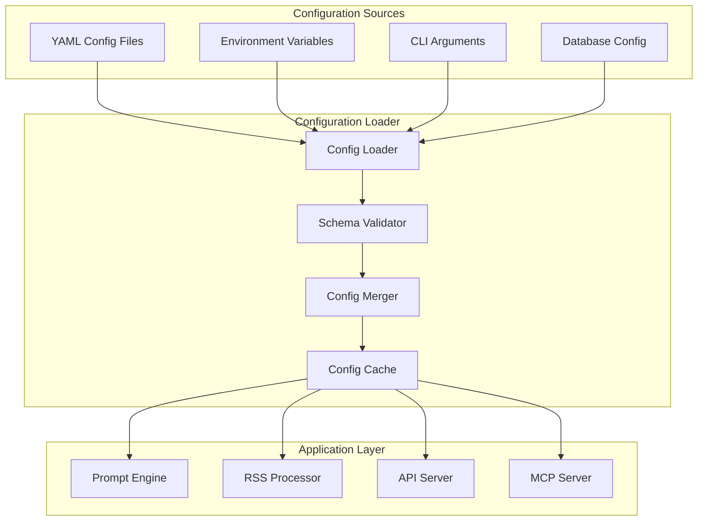

# Configuration System Design

## Executive Summary

The Bill Bot configuration system is built around YAML-based templates that provide flexible, environment-specific configuration management. The system supports prompt templates, RSS feed sources, model configurations, and feature flags while maintaining security through environment variable integration. The design emphasizes maintainability, validation, and hot-reloading capabilities for development environments.

## Configuration Architecture

### System Overview



### Configuration Hierarchy

1. **Default Configuration**: Base settings embedded in code
2. **YAML Files**: Environment-specific configuration files
3. **Environment Variables**: Sensitive data and deployment-specific overrides
4. **Database Settings**: Runtime configuration changes
5. **CLI Arguments**: Development and debugging overrides

## YAML Configuration Structure

### Master Configuration Schema

```yaml
# config/production.yml
app:
  name: "Bill Bot"
  version: "1.0.0"
  environment: "production"
  description: "AI-powered legislative bill exploration chatbot"
  
logging:
  level: "info"
  format: "json"
  outputs:
    - "console"
    - "file"
  logFile: "/var/log/billbot/app.log"
  maxSize: "100MB"
  maxFiles: 7

api:
  host: "0.0.0.0"
  port: 3001
  timeout: 30000
  maxRequestSize: "10mb"
  cors:
    origins:
      - "${FRONTEND_URL}"
      - "https://*.railway.app"
    credentials: true
    methods: ["GET", "POST", "PUT", "DELETE", "OPTIONS"]
  
  rateLimit:
    global:
      windowMs: 900000  # 15 minutes
      maxRequests: 100
    chat:
      windowMs: 60000   # 1 minute  
      maxRequests: 20
    search:
      windowMs: 60000   # 1 minute
      maxRequests: 50

security:
  jwt:
    secret: "${JWT_SECRET}"
    expiresIn: "24h"
  encryption:
    algorithm: "aes-256-gcm"
    key: "${ENCRYPTION_KEY}"
  headers:
    xFrameOptions: "SAMEORIGIN"
    xContentTypeOptions: "nosniff"
    xXssProtection: "1; mode=block"
    strictTransportSecurity: "max-age=31536000; includeSubDomains"

database:
  primary:
    url: "${DATABASE_URL}"
    pool:
      min: 2
      max: 10
      acquireTimeoutMillis: 30000
      idleTimeoutMillis: 30000
    ssl:
      rejectUnauthorized: false
  
  # No external cache - conversations are stateless/single-use

models:
  llm:
    name: "claude-sonnet-4"
    provider: "openrouter"
    modelId: "anthropic/claude-sonnet-4"
    apiKey: "${OPENROUTER_API_KEY}"
    maxTokens: 4000
    temperature: 0.7
    topP: 0.9
    stopSequences: []
    contextWindow: 200000
    costPer1MTokens:
      input: 3.0
      output: 15.0
  
  embedding:
    name: "embedding"
    provider: "cohere"
    modelId: "embed-english-v3.0"
    apiKey: "${COHERE_API_KEY}"
    dimensions: 384
    inputType: "search_document"
    costPer1kTokens: 0.0001

prompts:
  system:
    billSearch:
      id: "bill_search_system"
      name: "Bill Search System Prompt"
      description: "Primary system prompt for bill search and analysis"
      template: |
        You are Bill Bot, an AI assistant specialized in helping users explore and understand legislative bills from the U.S. Congress.

        Your role is to:
        - Help users find relevant bills using semantic and keyword search
        - Provide comprehensive analysis of bill content and implications
        - Explain legislative processes, procedures, and terminology
        - Offer context about bill progression through Congress
        - Generate accurate citations for all information provided

        Search Guidelines:
        - Use iterative search (up to ${search.maxIterations} iterations) to find comprehensive information
        - Start with broad searches and refine based on results
        - Consider multiple search approaches: semantic, keyword, and hybrid
        - Apply appropriate filters based on user intent

        Response Guidelines:
        - Always provide sources and citations for information
        - Be clear about data limitations and uncertainties
        - Use accessible language while maintaining accuracy
        - Structure responses logically with clear sections
        - Highlight key insights and implications

        Available tools enable you to search bills, retrieve details, and access legislative data from the U.S. Congress database.
      
      variables:
        - "search.maxIterations"
        - "features.citations"
        - "features.iterativeSearch"
    
    billSummary:
      id: "bill_summary"
      name: "Bill Summary Template"
      description: "Template for generating comprehensive bill summaries"
      template: |
        Create a comprehensive summary of this legislative bill:

        **Bill Information:**
        - Number: ${bill.number}
        - Title: ${bill.title}
        - Sponsor: ${bill.sponsor}
        - Chamber: ${bill.chamber}
        - Status: ${bill.status}
        - Introduced: ${bill.introducedDate}

        **Summary Requirements:**
        1. **Purpose and Goals**: Explain the bill's main objectives
        2. **Key Provisions**: Detail important sections and changes proposed
        3. **Impact Analysis**: Describe potential effects on various stakeholders
        4. **Legislative Context**: Place the bill within current policy debates
        5. **Process Status**: Explain current position in legislative process

        **Formatting:**
        - Use clear headings and bullet points
        - Include relevant quotes from the bill text
        - Provide context for technical terms
        - Maintain neutral, factual tone

        **Citations:**
        Always cite the official bill text and any supporting documents.
      
      variables:
        - "bill.number"
        - "bill.title"
        - "bill.sponsor"
        - "bill.chamber"
        - "bill.status"
        - "bill.introducedDate"
    
    executiveActions:
      id: "executive_actions_system"
      name: "Executive Actions System Prompt"
      description: "System prompt for executive actions search and analysis"
      template: |
        You are Bill Bot, specialized in exploring both Congressional bills and presidential executive actions.
        
        For executive actions, you can search:
        - Executive Orders (numbered directives with legal force)
        - Presidential Memoranda (instructions to federal agencies)
        - Proclamations (ceremonial and policy announcements)
        - Presidential Directives (national security guidance)
        
        Key differences from bills:
        - Executive actions are signed directly by the President
        - They follow different numbering systems (e.g., Executive Order 14081)
        - Status can be active, revoked, superseded, or amended
        - They affect specific federal agencies and policy areas
        
        When citing executive actions, use formats like:
        - "Executive Order 14081"
        - "Presidential Memorandum of March 15, 2023"
        - "Proclamation 10234"
        
        Available tools enable unified search across both bills and executive actions.
      
      variables:
        - "search.maxIterations"
        - "features.executiveActions"

  user:
    conversationStarter:
      id: "conversation_starter"
      name: "Conversation Starter Template"
      description: "Template for initiating conversations with users"
      template: |
        Hello! I'm Bill Bot, your AI assistant for exploring U.S. legislative information.
        
        I can help you:
        ${features.bills ? "📄 **Find and analyze Congressional bills**" : ""}
        ${features.executiveActions ? "📋 **Search presidential executive actions**" : ""}
        ${features.crossReference ? "🔗 **Discover relationships between bills and executive actions**" : ""}
        ${features.citations ? "📚 **Provide detailed citations and sources**" : ""}
        
        Try asking me about:
        - Recent legislation on specific topics
        - Bills sponsored by particular representatives
        - Executive orders from different administrations
        - How bills progress through Congress
        
        What would you like to explore today?
      
      variables:
        - "features.bills"
        - "features.executiveActions" 
        - "features.crossReference"
        - "features.citations"

    contextInjection:
      id: "context_injection"
      name: "Context Injection Template"
      description: "Template for injecting available context options"
      template: |
        ${hasSponsors ? "**AVAILABLE SPONSORS:**\n${sponsorsList}\n" : ""}
        ${hasStatuses ? "**VALID STATUS VALUES:**\n${statusesList}\n" : ""}
        ${hasTopics ? "**TOPIC CATEGORIES:**\n${topicsList}\n" : ""}
        ${hasAdministrations ? "**ADMINISTRATIONS:**\n${administrationsList}\n" : ""}
        ${hasAgencies ? "**FEDERAL AGENCIES:**\n${agenciesList}\n" : ""}
        
        **SEARCH GUIDELINES:**
        - Use exact names and values from the lists above
        - Never guess or invent parameter values
        - If unsure about available options, use context discovery tools first
        - Combine multiple search approaches for comprehensive results
      
      variables:
        - "hasSponsors"
        - "sponsorsList"
        - "hasStatuses"
        - "statusesList"
        - "hasTopics"
        - "topicsList"
        - "hasAdministrations"
        - "administrationsList"
        - "hasAgencies"
        - "agenciesList"

  responses:
    noResults:
      id: "no_results"
      name: "No Results Template"
      description: "Template for when search returns no results"
      template: |
        I couldn't find any ${searchType} matching your query "${query}".
        
        **Suggestions to improve your search:**
        ${searchType === 'bills' ? billjSuggestions : executiveActionSuggestions}
        
        Would you like me to:
        - Try a broader search with different keywords?
        - Search in a different time period?
        - Look for related topics or themes?
        ${searchType === 'bills' ? '- Search executive actions instead?' : '- Search bills instead?'}
      
      variables:
        - "searchType"
        - "query"
        - "billSuggestions"
        - "executiveActionSuggestions"

    searchRefinement:
      id: "search_refinement"
      name: "Search Refinement Template"
      description: "Template for explaining search refinement iterations"
      template: |
        **Search Progress (Iteration ${currentIteration}/${maxIterations}):**
        
        ${iterationSummary}
        
        **Current Strategy:** ${refinementStrategy}
        **Results Found:** ${resultsCount} ${contentType}
        ${needsMore ? "**Status:** Continuing search for more comprehensive results..." : "**Status:** Search complete"}
        
        ${partialResults ? "**Partial Results:** Showing initial findings while search continues..." : ""}
      
      variables:
        - "currentIteration"
        - "maxIterations"
        - "iterationSummary"
        - "refinementStrategy"
        - "resultsCount"
        - "contentType"
        - "needsMore"
        - "partialResults"

features:
  iterativeSearch:
    enabled: true
    maxIterations: 20
    refinementStrategies:
      - "expand_terms"
      - "narrow_focus"
      - "change_timeframe"
      - "adjust_filters"
  
  citations:
    enabled: true
    includeRelevanceScore: true
    includeExcerpts: true
    maxExcerptLength: 200
    citationFormats:
      - "apa"
      - "mla" 
      - "chicago"
  
  streaming:
    enabled: true
    chunkSize: 50
    bufferTimeout: 100
    maxConnections: 1000
  
  caching:
    enabled: false  # No caching - single-use conversations only
    contextData:
      ttl: 300  # 5 minutes for in-memory context cache only
      maxSize: 100

search:
  default:
    type: "hybrid"
    limit: 10
    semanticWeight: 0.7
    keywordWeight: 0.3
    threshold: 0.7
  
  semantic:
    model: "embed-english-v3.0"
    dimensions: 384
    similarity: "cosine"
    threshold: 0.7
  
  reranking:
    enabled: true
    model: "rerank-english-v3.0"
    topK: 20
    threshold: 0.8

feeds:
  enabled: true
  pollingInterval: 3600000  # 1 hour
  batchSize: 50
  retryAttempts: 3
  retryDelay: 5000
  
  sources:
    houseClerk:
      id: "house_clerk_bills"
      name: "House Clerk - New Bills"
      url: "https://clerk.house.gov/legislative/legisinfo/rss/BillsIntroduced.xml"
      type: "house"
      chamber: "house"
      enabled: true
      parser: "custom"
      fieldMappings:
        billNumber: "bill:number"
        sponsor: "bill:sponsor"
        status: "bill:status"
      schedule:
        frequency: "hourly"
        time: "0 * * * *"  # Every hour at minute 0
    
    senateBills:
      id: "senate_bills"
      name: "Senate Bills Feed"
      url: "https://www.senate.gov/legislative/LIS/rss/senate_bills.xml"
      type: "senate"
      chamber: "senate"
      enabled: true
      parser: "custom"
      fieldMappings:
        billNumber: "senate:billNumber"
        sponsor: "senate:sponsor"
      schedule:
        frequency: "daily"
        time: "0 6 * * *"  # Daily at 6 AM
    
    congressGov:
      id: "congress_gov_search"
      name: "Congress.gov Recent Bills"
      url: "https://www.congress.gov/rss/bills-118th-congress"
      type: "library_of_congress"
      chamber: "both"
      enabled: true
      parser: "standard"
      schedule:
        frequency: "hourly"
        time: "30 * * * *"  # Every hour at minute 30

monitoring:
  healthCheck:
    interval: 30000  # 30 seconds
    timeout: 5000    # 5 seconds
    retries: 3
    
  metrics:
    enabled: true
    port: 9090
    path: "/metrics"
    collectDefaults: true
    
  alerts:
    errorRate:
      threshold: 0.05  # 5%
      window: "5m"
    responseTime:
      threshold: 2000  # 2 seconds
      window: "5m"
    
performance:
  optimization:
    enableGzip: true
    enableBrotli: true
    staticAssetCaching: 86400  # 24 hours
    apiResponseCaching: 300    # 5 minutes
  
  limits:
    maxConcurrentRequests: 100
    maxRequestsPerMinute: 1000
    maxResponseSize: "50mb"
    maxQueryLength: 2000
```

## Configuration Loader Implementation

### TypeScript Configuration Types

```typescript
// src/config/types.ts
export interface AppConfig {
  name: string;
  version: string;
  environment: 'development' | 'staging' | 'production';
  description: string;
}

export interface LoggingConfig {
  level: 'debug' | 'info' | 'warn' | 'error';
  format: 'json' | 'text';
  outputs: string[];
  logFile?: string;
  maxSize?: string;
  maxFiles?: number;
}

export interface APIConfig {
  host: string;
  port: number;
  timeout: number;
  maxRequestSize: string;
  cors: {
    origins: string[];
    credentials: boolean;
    methods: string[];
  };
  rateLimit: {
    global: RateLimitConfig;
    chat: RateLimitConfig;
    search: RateLimitConfig;
  };
}

export interface RateLimitConfig {
  windowMs: number;
  maxRequests: number;
}

export interface ModelConfig {
  name: string;
  provider: 'openrouter';
  modelId: string;
  apiKey: string;
  maxTokens: number;
  temperature: number;
  topP: number;
  stopSequences?: string[];
  contextWindow: number;
  costPer1MTokens: {
    input: number;
    output: number;
  };
}

export interface PromptTemplate {
  id: string;
  name: string;
  description: string;
  template: string;
  variables: string[];
  examples?: Array<{
    input: Record<string, string>;
    output: string;
  }>;
}

export interface FeedSource {
  id: string;
  name: string;
  url: string;
  type: string;
  chamber: 'house' | 'senate' | 'both';
  enabled: boolean;
  parser: 'standard' | 'custom';
  fieldMappings?: Record<string, string>;
  schedule: {
    frequency: 'hourly' | 'daily' | 'weekly';
    time: string;
  };
}

export interface BillBotConfig {
  app: AppConfig;
  logging: LoggingConfig;
  api: APIConfig;
  security: SecurityConfig;
  database: DatabaseConfig;
  models: {
    primary: ModelConfig;
    fallback: ModelConfig;
    embedding: ModelConfig;
  };
  prompts: {
    system: Record<string, PromptTemplate>;
  };
  features: FeatureFlags;
  search: SearchConfig;
  feeds: {
    enabled: boolean;
    pollingInterval: number;
    batchSize: number;
    retryAttempts: number;
    retryDelay: number;
    sources: Record<string, FeedSource>;
  };
  monitoring: MonitoringConfig;
  performance: PerformanceConfig;
}
```

### Configuration Loader Class

```typescript
// src/config/loader.ts
import yaml from 'js-yaml';
import fs from 'fs/promises';
import path from 'path';
import Joi from 'joi';
import { BillBotConfig } from './types';

export class ConfigurationLoader {
  private static instance: ConfigurationLoader;
  private config: BillBotConfig | null = null;
  private watchers: Map<string, fs.FSWatcher> = new Map();

  private constructor() {}

  static getInstance(): ConfigurationLoader {
    if (!ConfigurationLoader.instance) {
      ConfigurationLoader.instance = new ConfigurationLoader();
    }
    return ConfigurationLoader.instance;
  }

  async loadConfig(environment?: string): Promise<BillBotConfig> {
    const env = environment || process.env.NODE_ENV || 'development';
    const configPath = path.join(process.cwd(), 'config', `${env}.yml`);
    
    try {
      console.log(`Loading configuration from ${configPath}`);
      
      // Load and parse YAML
      const configFile = await fs.readFile(configPath, 'utf8');
      const rawConfig = yaml.load(configFile) as any;
      
      // Process environment variable substitutions
      const processedConfig = this.processEnvironmentVariables(rawConfig);
      
      // Validate configuration
      const validatedConfig = await this.validateConfig(processedConfig);
      
      // Cache configuration
      this.config = validatedConfig;
      
      // Set up file watching in development
      if (env === 'development') {
        await this.setupConfigWatching(configPath);
      }
      
      console.log(`✓ Configuration loaded successfully for ${env} environment`);
      return this.config;
      
    } catch (error) {
      console.error(`Failed to load configuration from ${configPath}:`, error);
      throw new Error(`Configuration loading failed: ${error instanceof Error ? error.message : 'Unknown error'}`);
    }
  }

  private processEnvironmentVariables(config: any): any {
    // Deep clone to avoid mutating original
    const processed = JSON.parse(JSON.stringify(config));
    
    // Recursively process all string values
    this.processObjectRecursively(processed);
    
    return processed;
  }

  private processObjectRecursively(obj: any): void {
    for (const key in obj) {
      if (typeof obj[key] === 'string') {
        // Replace ${VAR_NAME} with environment variable values
        obj[key] = obj[key].replace(/\$\{([^}]+)\}/g, (match: string, varName: string) => {
          const envValue = process.env[varName];
          if (envValue === undefined) {
            if (process.env.NODE_ENV === 'production') {
              throw new Error(`Required environment variable ${varName} is not set`);
            }
            console.warn(`Environment variable ${varName} not found, keeping placeholder`);
            return match;
          }
          return envValue;
        });
      } else if (typeof obj[key] === 'object' && obj[key] !== null) {
        this.processObjectRecursively(obj[key]);
      }
    }
  }

  private async validateConfig(config: any): Promise<BillBotConfig> {
    const schema = this.getConfigSchema();
    
    const { error, value } = schema.validate(config, {
      abortEarly: false,
      stripUnknown: true,
      allowUnknown: false,
    });

    if (error) {
      const errorMessages = error.details.map(detail => detail.message);
      throw new Error(`Configuration validation failed:\n${errorMessages.join('\n')}`);
    }

    return value as BillBotConfig;
  }

  private getConfigSchema(): Joi.ObjectSchema {
    return Joi.object({
      app: Joi.object({
        name: Joi.string().required(),
        version: Joi.string().required(),
        environment: Joi.string().valid('development', 'staging', 'production').required(),
        description: Joi.string().required(),
      }).required(),

      logging: Joi.object({
        level: Joi.string().valid('debug', 'info', 'warn', 'error').required(),
        format: Joi.string().valid('json', 'text').required(),
        outputs: Joi.array().items(Joi.string()).required(),
        logFile: Joi.string().optional(),
        maxSize: Joi.string().optional(),
        maxFiles: Joi.number().integer().optional(),
      }).required(),

      api: Joi.object({
        host: Joi.string().required(),
        port: Joi.number().port().required(),
        timeout: Joi.number().integer().min(1000).required(),
        maxRequestSize: Joi.string().required(),
        cors: Joi.object({
          origins: Joi.array().items(Joi.string()).required(),
          credentials: Joi.boolean().required(),
          methods: Joi.array().items(Joi.string()).required(),
        }).required(),
        rateLimit: Joi.object({
          global: this.getRateLimitSchema(),
          chat: this.getRateLimitSchema(),
          search: this.getRateLimitSchema(),
        }).required(),
      }).required(),

      models: Joi.object({
        primary: this.getModelSchema(),
        fallback: this.getModelSchema(),
        embedding: this.getModelSchema(),
      }).required(),

      prompts: Joi.object({
        system: Joi.object().pattern(
          Joi.string(),
          Joi.object({
            id: Joi.string().required(),
            name: Joi.string().required(),
            description: Joi.string().required(),
            template: Joi.string().required(),
            variables: Joi.array().items(Joi.string()).required(),
            examples: Joi.array().items(Joi.object({
              input: Joi.object().required(),
              output: Joi.string().required(),
            })).optional(),
          })
        ).required(),
      }).required(),

      feeds: Joi.object({
        enabled: Joi.boolean().required(),
        pollingInterval: Joi.number().integer().min(60000).required(),
        batchSize: Joi.number().integer().min(1).required(),
        retryAttempts: Joi.number().integer().min(0).required(),
        retryDelay: Joi.number().integer().min(1000).required(),
        sources: Joi.object().pattern(
          Joi.string(),
          this.getFeedSourceSchema()
        ).required(),
      }).required(),

      // Additional schema definitions...
    });
  }

  private getRateLimitSchema(): Joi.ObjectSchema {
    return Joi.object({
      windowMs: Joi.number().integer().min(1000).required(),
      maxRequests: Joi.number().integer().min(1).required(),
    });
  }

  private getModelSchema(): Joi.ObjectSchema {
    return Joi.object({
      name: Joi.string().required(),
      provider: Joi.string().valid('openrouter', 'openai', 'anthropic', 'cohere').required(),
      modelId: Joi.string().required(),
      apiKey: Joi.string().required(),
      maxTokens: Joi.number().integer().min(1).required(),
      temperature: Joi.number().min(0).max(2).required(),
      topP: Joi.number().min(0).max(1).required(),
      stopSequences: Joi.array().items(Joi.string()).optional(),
      contextWindow: Joi.number().integer().min(1).required(),
      costPer1kTokens: Joi.object({
        input: Joi.number().min(0).required(),
        output: Joi.number().min(0).required(),
      }).required(),
    });
  }

  private getFeedSourceSchema(): Joi.ObjectSchema {
    return Joi.object({
      id: Joi.string().required(),
      name: Joi.string().required(),
      url: Joi.string().uri().required(),
      type: Joi.string().required(),
      chamber: Joi.string().valid('house', 'senate', 'both').required(),
      enabled: Joi.boolean().required(),
      parser: Joi.string().valid('standard', 'custom').required(),
      fieldMappings: Joi.object().pattern(Joi.string(), Joi.string()).optional(),
      schedule: Joi.object({
        frequency: Joi.string().valid('hourly', 'daily', 'weekly').required(),
        time: Joi.string().required(),
      }).required(),
    });
  }

  private async setupConfigWatching(configPath: string): Promise<void> {
    try {
      const watcher = fs.watch(configPath, { persistent: false });
      
      watcher.on('change', async () => {
        console.log('Configuration file changed, reloading...');
        try {
          await this.loadConfig();
          console.log('✓ Configuration reloaded successfully');
        } catch (error) {
          console.error('Failed to reload configuration:', error);
        }
      });

      this.watchers.set(configPath, watcher);
      console.log(`✓ Configuration file watching enabled for ${configPath}`);
      
    } catch (error) {
      console.warn('Failed to set up configuration file watching:', error);
    }
  }

  // Utility methods for accessing configuration
  getConfig(): BillBotConfig {
    if (!this.config) {
      throw new Error('Configuration not loaded. Call loadConfig() first.');
    }
    return this.config;
  }

  getPromptTemplate(id: string): PromptTemplate | null {
    const config = this.getConfig();
    return Object.values(config.prompts.system).find(template => template.id === id) || null;
  }

  getModelConfig(name: 'primary' | 'fallback' | 'embedding'): ModelConfig {
    const config = this.getConfig();
    return config.models[name];
  }

  getFeedSource(id: string): FeedSource | null {
    const config = this.getConfig();
    return config.feeds.sources[id] || null;
  }

  isFeatureEnabled(feature: string): boolean {
    const config = this.getConfig();
    return config.features[feature]?.enabled || false;
  }

  // Hot reload configuration (development only)
  async reloadConfig(): Promise<void> {
    if (process.env.NODE_ENV === 'production') {
      throw new Error('Configuration reloading is not allowed in production');
    }
    
    await this.loadConfig();
  }

  // Cleanup watchers
  cleanup(): void {
    for (const [path, watcher] of this.watchers) {
      watcher.close();
      console.log(`✓ Stopped watching configuration file: ${path}`);
    }
    this.watchers.clear();
  }
}

// Export singleton instance
export const configLoader = ConfigurationLoader.getInstance();
```

## Prompt Template Engine

### Template Processing

```typescript
// src/services/promptEngine.ts
import Handlebars from 'handlebars';
import { configLoader } from '../config/loader';
import { PromptTemplate } from '../config/types';

export class PromptEngine {
  private compiledTemplates = new Map<string, HandlebarsTemplateDelegate>();

  constructor() {
    this.registerHelpers();
  }

  private registerHelpers(): void {
    // Date formatting helper
    Handlebars.registerHelper('formatDate', (date: string | Date) => {
      return new Date(date).toLocaleDateString('en-US', {
        year: 'numeric',
        month: 'long',
        day: 'numeric',
      });
    });

    // Number formatting helper
    Handlebars.registerHelper('formatNumber', (num: number) => {
      return num.toLocaleString();
    });

    // Conditional helper
    Handlebars.registerHelper('ifEquals', function(arg1, arg2, options) {
      return (arg1 === arg2) ? options.fn(this) : options.inverse(this);
    });

    // List formatting helper
    Handlebars.registerHelper('list', (items: string[], separator: string = ', ') => {
      return items.join(separator);
    });

    // Truncate text helper
    Handlebars.registerHelper('truncate', (text: string, length: number = 100) => {
      return text.length > length ? text.substring(0, length) + '...' : text;
    });
  }

  compileTemplate(templateId: string): HandlebarsTemplateDelegate {
    if (this.compiledTemplates.has(templateId)) {
      return this.compiledTemplates.get(templateId)!;
    }

    const template = configLoader.getPromptTemplate(templateId);
    if (!template) {
      throw new Error(`Template not found: ${templateId}`);
    }

    const compiled = Handlebars.compile(template.template);
    this.compiledTemplates.set(templateId, compiled);
    
    return compiled;
  }

  renderTemplate(templateId: string, context: Record<string, any>): string {
    const compiled = this.compileTemplate(templateId);
    
    // Merge with configuration context
    const config = configLoader.getConfig();
    const fullContext = {
      ...context,
      config: {
        search: config.search,
        features: config.features,
        app: config.app,
      },
    };

    try {
      return compiled(fullContext);
    } catch (error) {
      throw new Error(`Template rendering failed for ${templateId}: ${error instanceof Error ? error.message : 'Unknown error'}`);
    }
  }

  validateTemplate(template: PromptTemplate): { valid: boolean; errors: string[] } {
    const errors: string[] = [];

    try {
      // Compile template to check syntax
      Handlebars.compile(template.template);
    } catch (error) {
      errors.push(`Template compilation failed: ${error instanceof Error ? error.message : 'Unknown error'}`);
    }

    // Check for required variables
    const templateContent = template.template;
    const declaredVariables = template.variables || [];
    const usedVariables = this.extractVariablesFromTemplate(templateContent);

    // Check for undeclared variables
    for (const usedVar of usedVariables) {
      if (!declaredVariables.includes(usedVar)) {
        errors.push(`Undeclared variable used in template: ${usedVar}`);
      }
    }

    // Check for unused declared variables
    for (const declaredVar of declaredVariables) {
      if (!usedVariables.includes(declaredVar)) {
        errors.push(`Declared variable not used in template: ${declaredVar}`);
      }
    }

    return {
      valid: errors.length === 0,
      errors,
    };
  }

  private extractVariablesFromTemplate(template: string): string[] {
    const variableRegex = /\{\{\s*([^}]+)\s*\}\}/g;
    const variables: string[] = [];
    let match;

    while ((match = variableRegex.exec(template)) !== null) {
      const variable = match[1].trim();
      // Remove handlebars helpers and filters
      const cleanVariable = variable.split(' ')[0].split('.')[0];
      if (!variables.includes(cleanVariable) && !this.isHandlebarsKeyword(cleanVariable)) {
        variables.push(cleanVariable);
      }
    }

    return variables;
  }

  private isHandlebarsKeyword(word: string): boolean {
    const keywords = ['if', 'unless', 'each', 'with', 'this', 'else', 'formatDate', 'formatNumber', 'ifEquals', 'list', 'truncate'];
    return keywords.includes(word);
  }

  // Clear compiled template cache (useful for development)
  clearCache(): void {
    this.compiledTemplates.clear();
  }

  // Get all available templates
  getAvailableTemplates(): PromptTemplate[] {
    const config = configLoader.getConfig();
    return Object.values(config.prompts.system);
  }
}

export const promptEngine = new PromptEngine();
```

## Environment-Specific Configurations

### Development Configuration

```yaml
# config/development.yml
app:
  name: "Bill Bot (Development)"
  version: "1.0.0-dev"
  environment: "development"

logging:
  level: "debug"
  format: "text"
  outputs: ["console"]

api:
  host: "localhost"
  port: 3001
  cors:
    origins: ["http://localhost:3000", "http://localhost:5173"]

database:
  primary:
    url: "postgresql://localhost:5432/billbot_dev"
    pool:
      min: 1
      max: 5

feeds:
  enabled: false  # Disable in development to avoid API calls
  pollingInterval: 3600000

features:
  iterativeSearch:
    enabled: true
    maxIterations: 5  # Reduced for development

monitoring:
  healthCheck:
    interval: 60000  # Less frequent in development
```

### Staging Configuration

```yaml
# config/staging.yml
app:
  name: "Bill Bot (Staging)"
  version: "1.0.0-staging"
  environment: "staging"

logging:
  level: "info"
  format: "json"
  outputs: ["console", "file"]

api:
  cors:
    origins: 
      - "https://billbot-staging.railway.app"
      - "https://billbot-staging-*.railway.app"

database:
  primary:
    url: "${STAGING_DATABASE_URL}"

feeds:
  enabled: true
  pollingInterval: 7200000  # 2 hours for staging

features:
  iterativeSearch:
    maxIterations: 15  # Reduced for staging
```

This configuration system provides a comprehensive, flexible foundation for Bill Bot with robust validation, environment-specific settings, and hot-reloading capabilities for development.