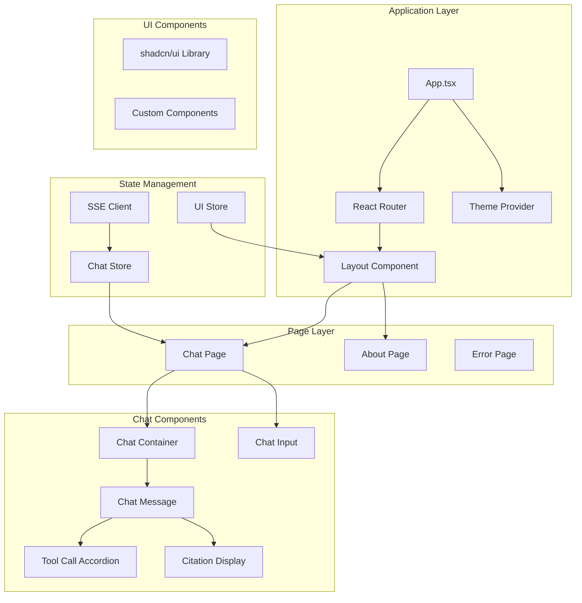

# Frontend Architecture

## Executive Summary

The Bill Bot frontend is architected as a modern React 19 application using TypeScript, Vite, shadcn/ui components, and Tailwind CSS v4. The architecture emphasizes real-time streaming interactions, elegant user experience, and comprehensive tool call feedback. The component hierarchy is designed for maintainability, performance, and accessibility, with a focus on single-use chat sessions and citation management.

## Component Hierarchy

### Application Structure



### Directory Structure

```
frontend/
├── src/
│   ├── components/
│   │   ├── chat/                 # Chat-specific components
│   │   │   ├── ChatContainer.tsx
│   │   │   ├── ChatMessage.tsx
│   │   │   ├── ChatInput.tsx
│   │   │   ├── ToolCallAccordion.tsx
│   │   │   ├── ToolCallDetails.tsx
│   │   │   ├── ToolCallFeedback.tsx
│   │   │   ├── CitationCard.tsx
│   │   │   ├── TypingIndicator.tsx
│   │   │   └── index.ts
│   │   ├── layout/               # Layout components
│   │   │   ├── Header.tsx
│   │   │   ├── Footer.tsx
│   │   │   ├── Sidebar.tsx
│   │   │   └── index.ts
│   │   ├── ui/                   # shadcn/ui components
│   │   │   ├── button.tsx
│   │   │   ├── card.tsx
│   │   │   ├── input.tsx
│   │   │   └── ...
│   │   └── common/               # Shared components
│   │       ├── ErrorBoundary.tsx
│   │       ├── LoadingSpinner.tsx
│   │       └── EmptyState.tsx
│   ├── pages/
│   │   ├── ChatPage.tsx
│   │   ├── AboutPage.tsx
│   │   └── ErrorPage.tsx
│   ├── stores/
│   │   ├── chatStore.ts
│   │   ├── toolCallStore.ts
│   │   ├── uiStore.ts
│   │   └── index.ts
│   ├── services/
│   │   ├── apiClient.ts
│   │   ├── sseClient.ts
│   │   └── index.ts
│   ├── hooks/
│   │   ├── useChat.ts
│   │   ├── useSSE.ts
│   │   ├── useDebounce.ts
│   │   └── index.ts
│   ├── types/
│   │   ├── chat.ts
│   │   ├── toolCalls.ts
│   │   ├── api.ts
│   │   ├── citations.ts
│   │   └── index.ts
│   ├── lib/
│   │   ├── utils.ts
│   │   ├── constants.ts
│   │   └── validations.ts
│   └── styles/
│       └── globals.css
```

## Core Component Specifications

### Chat Container Component

```typescript
// src/components/chat/ChatContainer.tsx
interface ChatContainerProps {
  className?: string;
}

interface ChatContainerState {
  isScrolledToBottom: boolean;
  shouldAutoScroll: boolean;
}

export function ChatContainer({ className }: ChatContainerProps) {
  const { messages, isLoading, error } = useChatStore();
  const { isScrolledToBottom, shouldAutoScroll } = useScrollTracking();
  const containerRef = useRef<HTMLDivElement>(null);
  const bottomRef = useRef<HTMLDivElement>(null);

  // Auto-scroll behavior
  useEffect(() => {
    if (shouldAutoScroll && bottomRef.current) {
      bottomRef.current.scrollIntoView({ behavior: 'smooth' });
    }
  }, [messages, shouldAutoScroll]);

  // Scroll tracking for user interaction
  const handleScroll = useCallback(() => {
    if (!containerRef.current) return;
    
    const { scrollTop, scrollHeight, clientHeight } = containerRef.current;
    const isAtBottom = scrollTop + clientHeight >= scrollHeight - 10;
    
    setIsScrolledToBottom(isAtBottom);
  }, []);

  if (messages.length === 0 && !isLoading) {
    return <EmptyState />;
  }

  return (
    <div className="flex-1 relative">
      <ScrollArea 
        className={cn('h-full', className)}
        ref={containerRef}
        onScrollCapture={handleScroll}
      >
        <div className="space-y-6 p-4 pb-16">
          {messages.map((message) => (
            <ChatMessage 
              key={message.id} 
              message={message}
              className="animate-fade-in-up"
            />
          ))}
          
          {isLoading && <TypingIndicator />}
          {error && <ErrorMessage error={error} />}
          
          <div ref={bottomRef} />
        </div>
      </ScrollArea>
      
      {!isScrolledToBottom && messages.length > 0 && (
        <ScrollToBottomButton 
          onClick={() => bottomRef.current?.scrollIntoView({ behavior: 'smooth' })}
        />
      )}
    </div>
  );
}
```

### Chat Message Component

```typescript
// src/components/chat/ChatMessage.tsx
interface ChatMessageProps {
  message: Message;
  className?: string;
}

interface Message {
  id: string;
  content: string;
  role: 'user' | 'assistant';
  timestamp: Date;
  citations?: Citation[];
  toolCalls?: ToolCall[];
  isStreaming?: boolean;
  metadata?: MessageMetadata;
}

export function ChatMessage({ message, className }: ChatMessageProps) {
  const [isToolCallsExpanded, setIsToolCallsExpanded] = useState(false);
  const [isCitationsExpanded, setIsCitationsExpanded] = useState(true);
  
  const isUser = message.role === 'user';
  const hasToolCalls = message.toolCalls && message.toolCalls.length > 0;
  const hasCitations = message.citations && message.citations.length > 0;

  return (
    <div className={cn('flex gap-4 max-w-5xl mx-auto', className)}>
      <MessageAvatar role={message.role} />
      
      <div className="flex-1 space-y-3">
        <MessageHeader 
          role={message.role}
          timestamp={message.timestamp}
          isStreaming={message.isStreaming}
          metadata={message.metadata}
        />
        
        <MessageContent 
          content={message.content}
          isStreaming={message.isStreaming}
          role={message.role}
        />
        
        {/* Tool Call Feedback - Real-time tool execution updates */}
        <ToolCallFeedback />
        
        {hasToolCalls && (
          <ToolCallAccordion
            toolCalls={message.toolCalls}
            isExpanded={isToolCallsExpanded}
            onToggle={setIsToolCallsExpanded}
          />
        )}
        
        {hasCitations && (
          <CitationSection
            citations={message.citations}
            isExpanded={isCitationsExpanded}
            onToggle={setIsCitationsExpanded}
          />
        )}
        
        <MessageActions message={message} />
      </div>
    </div>
  );
}
```

### Tool Call Accordion Component

```typescript
// src/components/chat/ToolCallAccordion.tsx
interface ToolCallAccordionProps {
  toolCalls: ToolCall[];
  isExpanded: boolean;
  onToggle: (expanded: boolean) => void;
}

interface ToolCall {
  id: string;
  name: string;
  arguments: Record<string, any>;
  result?: any;
  status: 'pending' | 'completed' | 'failed';
  duration?: number;
  timestamp: Date;
  metadata?: {
    iteration?: number;
    searchType?: string;
    resultCount?: number;
  };
}

export function ToolCallAccordion({ 
  toolCalls, 
  isExpanded, 
  onToggle 
}: ToolCallAccordionProps) {
  const totalCalls = toolCalls.length;
  const completedCalls = toolCalls.filter(call => call.status === 'completed').length;
  const failedCalls = toolCalls.filter(call => call.status === 'failed').length;

  return (
    <Accordion 
      type="single" 
      value={isExpanded ? "tool-calls" : ""}
      onValueChange={(value) => onToggle(value === "tool-calls")}
    >
      <AccordionItem value="tool-calls" className="border rounded-lg">
        <AccordionTrigger className="px-4 py-3 hover:no-underline">
          <div className="flex items-center gap-3 text-sm">
            <ToolCallIcon />
            <span className="font-medium">
              Database Operations ({completedCalls}/{totalCalls})
            </span>
            <ToolCallStatusBadges 
              completed={completedCalls}
              failed={failedCalls}
              pending={totalCalls - completedCalls - failedCalls}
            />
          </div>
        </AccordionTrigger>
        
        <AccordionContent className="px-4 pb-4">
          <div className="space-y-3">
            {toolCalls.map((toolCall, index) => (
              <ToolCallItem 
                key={toolCall.id}
                toolCall={toolCall}
                index={index + 1}
              />
            ))}
          </div>
        </AccordionContent>
      </AccordionItem>
    </Accordion>
  );
}

function ToolCallItem({ toolCall, index }: { toolCall: ToolCall; index: number }) {
  const [isDetailsExpanded, setIsDetailsExpanded] = useState(false);
  
  return (
    <Card className="overflow-hidden">
      <div className="p-3">
        <div className="flex items-center justify-between mb-2">
          <div className="flex items-center gap-2">
            <Badge variant="outline" className="text-xs">
              {index}
            </Badge>
            <span className="font-medium text-sm">{toolCall.name}</span>
            <ToolCallStatusIcon status={toolCall.status} />
          </div>
          
          <div className="flex items-center gap-2 text-xs text-muted-foreground">
            {toolCall.duration && (
              <span>{toolCall.duration}ms</span>
            )}
            <Button
              variant="ghost"
              size="sm"
              onClick={() => setIsDetailsExpanded(!isDetailsExpanded)}
              className="h-6 w-6 p-0"
            >
              <ChevronDown 
                className={cn(
                  "h-3 w-3 transition-transform",
                  isDetailsExpanded && "rotate-180"
                )}
              />
            </Button>
          </div>
        </div>
        
        <div className="text-sm text-muted-foreground">
          {toolCall.metadata?.searchType && (
            <span>Search type: {toolCall.metadata.searchType}</span>
          )}
          {toolCall.metadata?.resultCount !== undefined && (
            <span className="ml-2">
              Results: {toolCall.metadata.resultCount}
            </span>
          )}
          {toolCall.metadata?.iteration && (
            <span className="ml-2">
              Iteration: {toolCall.metadata.iteration}
            </span>
          )}
        </div>
        
        <Collapsible open={isDetailsExpanded}>
          <CollapsibleContent className="mt-3">
            <Tabs defaultValue="arguments" className="w-full">
              <TabsList className="grid w-full grid-cols-2">
                <TabsTrigger value="arguments">Arguments</TabsTrigger>
                <TabsTrigger value="result">Result</TabsTrigger>
              </TabsList>
              
              <TabsContent value="arguments" className="mt-3">
                <CodeBlock 
                  code={JSON.stringify(toolCall.arguments, null, 2)}
                  language="json"
                />
              </TabsContent>
              
              <TabsContent value="result" className="mt-3">
                {toolCall.result ? (
                  <CodeBlock 
                    code={JSON.stringify(toolCall.result, null, 2)}
                    language="json"
                  />
                ) : (
                  <div className="text-sm text-muted-foreground p-3 border rounded">
                    No result available
                  </div>
                )}
              </TabsContent>
            </Tabs>
          </CollapsibleContent>
        </Collapsible>
      </div>
    </Card>
  );
}
```

### Citation Display Component

```typescript
// src/components/chat/CitationCard.tsx
interface CitationCardProps {
  citation: Citation;
  index: number;
  variant?: 'default' | 'compact';
}

interface Citation {
  id: string;
  type: 'bill' | 'amendment' | 'vote';
  title: string;
  url: string;
  relevanceScore: number;
  excerpt: string;
  billNumber?: string;
  sponsor?: string;
  chamber?: 'house' | 'senate';
  status?: string;
  introducedDate?: string;
  source: {
    name: string;
    type: string;
    publishedDate?: string;
  };
  searchContext: {
    query: string;
    rank: number;
    searchTimestamp: string;
  };
}

export function CitationCard({ 
  citation, 
  index, 
  variant = 'default' 
}: CitationCardProps) {
  const [isExpanded, setIsExpanded] = useState(false);
  
  return (
    <Card className="overflow-hidden hover:shadow-md transition-shadow">
      <div className="p-4">
        <div className="flex items-start gap-3">
          <Badge 
            variant="secondary" 
            className="text-xs font-medium shrink-0 mt-1"
          >
            {index}
          </Badge>
          
          <div className="flex-1 min-w-0 space-y-2">
            <div className="flex items-start justify-between gap-2">
              <a
                href={citation.url}
                target="_blank"
                rel="noopener noreferrer"
                className="font-medium text-sm hover:underline line-clamp-2"
              >
                {citation.title}
              </a>
              
              <RelevanceScore score={citation.relevanceScore} />
            </div>
            
            <div className="flex items-center gap-2 text-xs text-muted-foreground">
              {citation.billNumber && (
                <Badge variant="outline" className="text-xs">
                  {citation.billNumber}
                </Badge>
              )}
              {citation.chamber && (
                <Badge 
                  variant="outline" 
                  className={cn(
                    "text-xs",
                    citation.chamber === 'house' ? 'bg-blue-50' : 'bg-red-50'
                  )}
                >
                  {citation.chamber === 'house' ? 'House' : 'Senate'}
                </Badge>
              )}
              {citation.status && (
                <Badge variant="outline" className="text-xs">
                  {citation.status}
                </Badge>
              )}
            </div>
            
            <CitationExcerpt 
              excerpt={citation.excerpt}
              query={citation.searchContext.query}
              isExpanded={isExpanded}
              onToggle={setIsExpanded}
            />
            
            <CitationMetadata citation={citation} />
          </div>
        </div>
      </div>
    </Card>
  );
}

function CitationExcerpt({ 
  excerpt, 
  query, 
  isExpanded, 
  onToggle 
}: {
  excerpt: string;
  query: string;
  isExpanded: boolean;
  onToggle: (expanded: boolean) => void;
}) {
  const shouldTruncate = excerpt.length > 150;
  const displayText = isExpanded ? excerpt : excerpt.substring(0, 150);
  
  // Highlight query terms
  const highlightedText = highlightSearchTerms(displayText, query);
  
  return (
    <div className="text-sm text-muted-foreground">
      <div 
        dangerouslySetInnerHTML={{ __html: highlightedText }}
        className="leading-relaxed"
      />
      {shouldTruncate && !isExpanded && <span>...</span>}
      
      {shouldTruncate && (
        <Button
          variant="ghost"
          size="sm"
          onClick={() => onToggle(!isExpanded)}
          className="h-auto p-0 text-xs text-primary hover:bg-transparent"
        >
          {isExpanded ? 'Show less' : 'Show more'}
        </Button>
      )}
    </div>
  );
}
```

### Chat Input Component

```typescript
// src/components/chat/ChatInput.tsx
interface ChatInputProps {
  onSendMessage: (message: string) => void;
  isLoading?: boolean;
  onStopGeneration?: () => void;
  disabled?: boolean;
}

export function ChatInput({ 
  onSendMessage, 
  isLoading = false,
  onStopGeneration,
  disabled = false 
}: ChatInputProps) {
  const [message, setMessage] = useState('');
  const [isComposing, setIsComposing] = useState(false);
  const textareaRef = useRef<HTMLTextAreaElement>(null);
  const { debouncedValue: debouncedMessage } = useDebounce(message, 300);

  // Auto-resize textarea
  const adjustTextareaHeight = useCallback(() => {
    const textarea = textareaRef.current;
    if (!textarea) return;
    
    textarea.style.height = 'auto';
    const scrollHeight = textarea.scrollHeight;
    const maxHeight = 200; // Maximum height in pixels
    
    textarea.style.height = `${Math.min(scrollHeight, maxHeight)}px`;
  }, []);

  useEffect(() => {
    adjustTextareaHeight();
  }, [message, adjustTextareaHeight]);

  const handleSubmit = useCallback((e: React.FormEvent) => {
    e.preventDefault();
    
    if (!message.trim() || isLoading || disabled || isComposing) {
      return;
    }
    
    onSendMessage(message.trim());
    setMessage('');
    
    // Reset textarea height
    setTimeout(() => {
      if (textareaRef.current) {
        textareaRef.current.style.height = 'auto';
      }
    }, 0);
  }, [message, isLoading, disabled, isComposing, onSendMessage]);

  const handleKeyDown = useCallback((e: React.KeyboardEvent) => {
    if (e.key === 'Enter' && !e.shiftKey && !isComposing) {
      e.preventDefault();
      handleSubmit(e);
    }
  }, [handleSubmit, isComposing]);

  const handleCompositionStart = () => setIsComposing(true);
  const handleCompositionEnd = () => setIsComposing(false);

  const characterCount = message.length;
  const maxCharacters = 2000;
  const isNearLimit = characterCount > maxCharacters * 0.8;
  const isOverLimit = characterCount > maxCharacters;

  return (
    <div className="border-t bg-background/80 backdrop-blur-sm">
      <div className="max-w-5xl mx-auto p-4">
        <form onSubmit={handleSubmit} className="space-y-3">
          <div className="relative">
            <Textarea
              ref={textareaRef}
              value={message}
              onChange={(e) => setMessage(e.target.value)}
              onKeyDown={handleKeyDown}
              onCompositionStart={handleCompositionStart}
              onCompositionEnd={handleCompositionEnd}
              placeholder="Ask about legislative bills..."
              disabled={disabled}
              className={cn(
                "min-h-[44px] max-h-[200px] resize-none pr-16 py-3",
                "focus:ring-2 focus:ring-primary/20",
                isOverLimit && "border-destructive focus:ring-destructive/20"
              )}
              rows={1}
              maxLength={maxCharacters}
            />
            
            {/* Character count */}
            <div className={cn(
              "absolute bottom-2 right-12 text-xs",
              isNearLimit 
                ? isOverLimit 
                  ? "text-destructive" 
                  : "text-yellow-600"
                : "text-muted-foreground"
            )}>
              {characterCount}/{maxCharacters}
            </div>
            
            {/* Send/Stop button */}
            <div className="absolute bottom-2 right-2">
              {isLoading ? (
                <Button
                  type="button"
                  variant="destructive"
                  size="sm"
                  onClick={onStopGeneration}
                  className="h-8 w-8 p-0"
                >
                  <Square className="h-3 w-3" />
                </Button>
              ) : (
                <Button
                  type="submit"
                  disabled={!message.trim() || disabled || isOverLimit}
                  size="sm"
                  className="h-8 w-8 p-0"
                >
                  <Send className="h-3 w-3" />
                </Button>
              )}
            </div>
          </div>
          
          <QuickActions 
            onActionClick={setMessage}
            disabled={isLoading || disabled}
          />
        </form>
      </div>
    </div>
  );
}

function QuickActions({ 
  onActionClick, 
  disabled 
}: { 
  onActionClick: (text: string) => void;
  disabled: boolean;
}) {
  const quickActions = [
    {
      label: "Recent bills",
      query: "What bills were introduced this week?",
      icon: Calendar,
    },
    {
      label: "Healthcare legislation",
      query: "Show me recent healthcare legislation",
      icon: Heart,
    },
    {
      label: "Climate bills",
      query: "Find climate change related bills",
      icon: Leaf,
    },
    {
      label: "Infrastructure",
      query: "What infrastructure bills are in Congress?",
      icon: Building,
    },
  ];

  return (
    <div className="flex flex-wrap gap-2">
      {quickActions.map((action) => (
        <Button
          key={action.label}
          type="button"
          variant="outline"
          size="sm"
          onClick={() => onActionClick(action.query)}
          disabled={disabled}
          className="text-xs h-7"
        >
          <action.icon className="h-3 w-3 mr-1" />
          {action.label}
        </Button>
      ))}
    </div>
  );
}
```

## State Management

### Chat Store (Zustand)

```typescript
// src/stores/chatStore.ts
interface ChatState {
  // State
  messages: Message[];
  isLoading: boolean;
  isStreaming: boolean;
  error: string | null;
  currentSessionId: string | null;
  
  // SSE Connection
  sseConnection: SSEClient | null;
  connectionStatus: 'disconnected' | 'connecting' | 'connected' | 'error';
  
  // UI State
  toolCallsExpanded: Record<string, boolean>;
  citationsExpanded: Record<string, boolean>;
  
  // Actions
  startNewSession: () => void;
  sendMessage: (content: string) => Promise<void>;
  stopGeneration: () => void;
  clearMessages: () => void;
  
  // Message management
  addMessage: (message: Omit<Message, 'id' | 'timestamp'>) => void;
  updateMessage: (id: string, updates: Partial<Message>) => void;
  appendToMessage: (id: string, content: string) => void;
  addToolCall: (messageId: string, toolCall: ToolCall) => void;
  updateToolCall: (messageId: string, toolCallId: string, updates: Partial<ToolCall>) => void;
  addCitation: (messageId: string, citation: Citation) => void;
  
  // UI actions
  toggleToolCalls: (messageId: string) => void;
  toggleCitations: (messageId: string) => void;
  setError: (error: string | null) => void;
}

export const useChatStore = create<ChatState>()(
  devtools(
    (set, get) => ({
      // Initial state
      messages: [],
      isLoading: false,
      isStreaming: false,
      error: null,
      currentSessionId: null,
      sseConnection: null,
      connectionStatus: 'disconnected',
      toolCallsExpanded: {},
      citationsExpanded: {},

      // Start new session
      startNewSession: () => {
        const sessionId = `session_${Date.now()}_${Math.random().toString(36).substr(2, 9)}`;
        
        set({
          currentSessionId: sessionId,
          messages: [],
          error: null,
          toolCallsExpanded: {},
          citationsExpanded: {},
        });
      },

      // Send message and establish SSE connection
      sendMessage: async (content: string) => {
        const state = get();
        const sessionId = state.currentSessionId || crypto.randomUUID();
        
        if (!state.currentSessionId) {
          set({ currentSessionId: sessionId });
        }

        // Add user message
        const userMessage: Message = {
          id: crypto.randomUUID(),
          content,
          role: 'user',
          timestamp: new Date(),
        };
        
        set(state => ({
          messages: [...state.messages, userMessage],
          isLoading: true,
          error: null,
        }));

        try {
          // Create SSE connection
          const sseClient = new SSEClient(`/api/chat/stream`, {
            onConnectionOpen: () => {
              set({ connectionStatus: 'connected' });
            },
            
            onMessage: (message) => {
              handleSSEMessage(message, get, set);
            },
            
            onError: (error) => {
              set({ 
                error: `Connection error: ${error}`,
                isLoading: false,
                isStreaming: false,
                connectionStatus: 'error'
              });
            },
            
            onConnectionClose: () => {
              set({ 
                connectionStatus: 'disconnected',
                isLoading: false,
                isStreaming: false
              });
            },
          });

          set({ 
            sseConnection: sseClient,
            connectionStatus: 'connecting'
          });

          // Start the SSE connection
          sseClient.connect();
          
          // Send the message to start processing
          await fetch('/api/chat/stream', {
            method: 'POST',
            headers: {
              'Content-Type': 'application/json',
            },
            body: JSON.stringify({
              message: content,
              sessionId,
              connectionId: sseClient.getConnectionId(),
            }),
          });

        } catch (error) {
          set({ 
            error: `Failed to send message: ${error instanceof Error ? error.message : 'Unknown error'}`,
            isLoading: false,
            connectionStatus: 'error'
          });
        }
      },

      stopGeneration: () => {
        const state = get();
        
        if (state.sseConnection) {
          state.sseConnection.disconnect();
        }
        
        set({
          isLoading: false,
          isStreaming: false,
          sseConnection: null,
          connectionStatus: 'disconnected',
        });
      },

      clearMessages: () => {
        set({
          messages: [],
          toolCallsExpanded: {},
          citationsExpanded: {},
        });
      },

      // Message management actions
      addMessage: (message) => {
        set(state => ({
          messages: [
            ...state.messages,
            {
              ...message,
              id: crypto.randomUUID(),
              timestamp: new Date(),
            },
          ],
        }));
      },

      updateMessage: (id, updates) => {
        set(state => ({
          messages: state.messages.map(msg =>
            msg.id === id ? { ...msg, ...updates } : msg
          ),
        }));
      },

      appendToMessage: (id, content) => {
        set(state => ({
          messages: state.messages.map(msg =>
            msg.id === id 
              ? { ...msg, content: msg.content + content }
              : msg
          ),
        }));
      },

      addToolCall: (messageId, toolCall) => {
        set(state => ({
          messages: state.messages.map(msg =>
            msg.id === messageId
              ? {
                  ...msg,
                  toolCalls: [...(msg.toolCalls || []), toolCall],
                }
              : msg
          ),
        }));
      },

      updateToolCall: (messageId, toolCallId, updates) => {
        set(state => ({
          messages: state.messages.map(msg =>
            msg.id === messageId
              ? {
                  ...msg,
                  toolCalls: msg.toolCalls?.map(call =>
                    call.id === toolCallId ? { ...call, ...updates } : call
                  ),
                }
              : msg
          ),
        }));
      },

      addCitation: (messageId, citation) => {
        set(state => ({
          messages: state.messages.map(msg =>
            msg.id === messageId
              ? {
                  ...msg,
                  citations: [...(msg.citations || []), citation],
                }
              : msg
          ),
        }));
      },

      // UI actions
      toggleToolCalls: (messageId) => {
        set(state => ({
          toolCallsExpanded: {
            ...state.toolCallsExpanded,
            [messageId]: !state.toolCallsExpanded[messageId],
          },
        }));
      },

      toggleCitations: (messageId) => {
        set(state => ({
          citationsExpanded: {
            ...state.citationsExpanded,
            [messageId]: !state.citationsExpanded[messageId],
          },
        }));
      },

      setError: (error) => {
        set({ error });
      },
    }),
    { name: 'chat-store' }
  )
);
```

### SSE Message Handler

```typescript
// Handle incoming SSE messages
function handleSSEMessage(
  message: SSEMessage,
  get: () => ChatState,
  set: (updater: (state: ChatState) => Partial<ChatState>) => void
) {
  const state = get();
  
  switch (message.type) {
    case 'start':
      // Assistant message started
      const assistantMessage: Message = {
        id: crypto.randomUUID(),
        content: '',
        role: 'assistant',
        timestamp: new Date(),
        isStreaming: true,
        toolCalls: [],
        citations: [],
      };
      
      set(state => ({
        messages: [...state.messages, assistantMessage],
        isStreaming: true,
      }));
      break;

    case 'content':
      // Append content to the last assistant message
      const lastMessage = state.messages[state.messages.length - 1];
      if (lastMessage && lastMessage.role === 'assistant') {
        set(state => ({
          messages: state.messages.map((msg, index) =>
            index === state.messages.length - 1
              ? { ...msg, content: msg.content + message.data.content }
              : msg
          ),
        }));
      }
      break;

    case 'tool_call':
      // Add or update tool call
      const toolCallData = message.data;
      const currentMessage = state.messages[state.messages.length - 1];
      
      if (currentMessage && currentMessage.role === 'assistant') {
        const existingToolCall = currentMessage.toolCalls?.find(
          call => call.id === toolCallData.id
        );
        
        if (existingToolCall) {
          // Update existing tool call
          get().updateToolCall(currentMessage.id, toolCallData.id, toolCallData);
        } else {
          // Add new tool call
          get().addToolCall(currentMessage.id, {
            id: toolCallData.id,
            name: toolCallData.name,
            arguments: toolCallData.arguments,
            status: 'pending',
            timestamp: new Date(),
          });
        }
      }
      break;

    case 'citation':
      // Add citation to the last assistant message
      const citationMessage = state.messages[state.messages.length - 1];
      if (citationMessage && citationMessage.role === 'assistant') {
        get().addCitation(citationMessage.id, message.data);
      }
      break;

    case 'error':
      set({
        error: message.data.error,
        isLoading: false,
        isStreaming: false,
      });
      break;

    case 'end':
      // Finalize the assistant message
      const finalMessage = state.messages[state.messages.length - 1];
      if (finalMessage && finalMessage.role === 'assistant') {
        set(state => ({
          messages: state.messages.map((msg, index) =>
            index === state.messages.length - 1
              ? { ...msg, isStreaming: false }
              : msg
          ),
          isLoading: false,
          isStreaming: false,
        }));
      }
      break;
  }
}
```

## Performance Optimizations

### Component Memoization

```typescript
// Memoized components for performance
const MemoizedChatMessage = React.memo(ChatMessage, (prevProps, nextProps) => {
  // Only re-render if message content, toolCalls, or citations change
  return (
    prevProps.message.content === nextProps.message.content &&
    prevProps.message.isStreaming === nextProps.message.isStreaming &&
    JSON.stringify(prevProps.message.toolCalls) === JSON.stringify(nextProps.message.toolCalls) &&
    JSON.stringify(prevProps.message.citations) === JSON.stringify(nextProps.message.citations)
  );
});

const MemoizedCitationCard = React.memo(CitationCard, (prevProps, nextProps) => {
  return (
    prevProps.citation.id === nextProps.citation.id &&
    prevProps.index === nextProps.index
  );
});
```

### Virtual Scrolling for Large Message Lists

```typescript
// For handling large numbers of messages efficiently
import { FixedSizeList as List } from 'react-window';

function VirtualizedChatContainer({ messages }: { messages: Message[] }) {
  const Row = ({ index, style }: { index: number; style: React.CSSProperties }) => (
    <div style={style}>
      <MemoizedChatMessage message={messages[index]} />
    </div>
  );

  return (
    <List
      height={600}
      itemCount={messages.length}
      itemSize={200} // Average message height
      className="chat-list"
    >
      {Row}
    </List>
  );
}
```

This frontend architecture provides a robust, performant, and user-friendly interface for Bill Bot with comprehensive real-time features, elegant tool call feedback, and efficient state management.