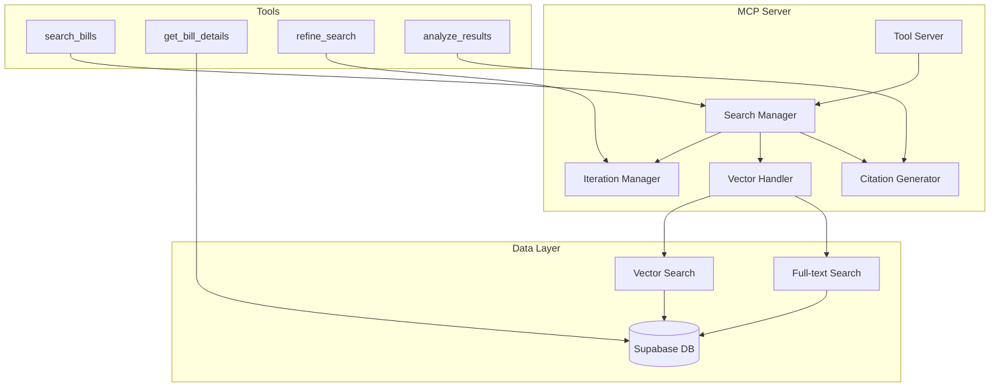

# MCP Server Architecture

## Executive Summary

The Model Context Protocol (MCP) server serves as the intelligent data access layer for Bill Bot, providing iterative search capabilities with a maximum of 20 iterations per query. The server implements a tool-based architecture that enables the LLM to perform sophisticated database operations, refine search queries, and generate comprehensive citations. This design ensures optimal data retrieval while maintaining performance and reliability.

## MCP Server Overview

### Core Responsibilities
- **Tool-based Database Access**: Expose database operations as standardized MCP tools
- **Iterative Search Logic**: Enable progressive query refinement up to 20 iterations
- **Vector Search Integration**: Leverage Supabase vector capabilities for semantic search
- **Citation Generation**: Produce structured citations with relevance scoring
- **Error Handling**: Graceful degradation and comprehensive error reporting

### Architecture Pattern


## Tool Definitions

### Primary Search Tool

```typescript
interface SearchBillsTool {
  name: "search_bills";
  description: "Search legislative bills with iterative refinement capabilities";
  inputSchema: {
    type: "object";
    properties: {
      query: {
        type: "string";
        description: "Search query for bills (keywords, topics, or natural language)";
      };
      searchType: {
        type: "string";
        enum: ["semantic", "keyword", "hybrid"];
        default: "hybrid";
        description: "Type of search to perform";
      };
      filters: {
        type: "object";
        properties: {
          chamber: {
            type: "string";
            enum: ["house", "senate"];
            description: "Filter by chamber of origin";
          };
          status: {
            type: "array";
            items: {
              type: "string";
              enum: ["introduced", "referred", "reported", "passed_house", "passed_senate", "enrolled", "signed"];
            };
            description: "Filter by bill status";
          };
          congress: {
            type: "integer";
            minimum: 100;
            description: "Filter by Congress number";
          };
          dateRange: {
            type: "object";
            properties: {
              from: { type: "string"; format: "date" };
              to: { type: "string"; format: "date" };
            };
            description: "Filter by introduction date range";
          };
          sponsor: {
            type: "string";
            description: "Filter by bill sponsor name";
          };
          topics: {
            type: "array";
            items: { type: "string" };
            description: "Filter by topic categories";
          };
        };
      };
      limit: {
        type: "integer";
        minimum: 1;
        maximum: 50;
        default: 10;
        description: "Maximum number of results to return";
      };
      iteration: {
        type: "integer";
        minimum: 1;
        maximum: 20;
        default: 1;
        description: "Current iteration number for iterative search";
      };
      previousResults: {
        type: "array";
        description: "Previous search results for context in iterative searches";
      };
    };
    required: ["query"];
  };
}
```

### Bill Details Tool

```typescript
interface GetBillDetailsTool {
  name: "get_bill_details";
  description: "Retrieve comprehensive details for a specific bill";
  inputSchema: {
    type: "object";
    properties: {
      billId: {
        type: "string";
        description: "Bill ID or bill number (e.g., 'H.R.1234' or database ID)";
      };
      includeActions: {
        type: "boolean";
        default: true;
        description: "Include legislative actions timeline";
      };
      includeVotes: {
        type: "boolean";
        default: true;
        description: "Include voting records";
      };
      includeAmendments: {
        type: "boolean";
        default: false;
        description: "Include amendment information";
      };
    };
    required: ["billId"];
  };
}
```

### Search Refinement Tool

```typescript
interface RefineSearchTool {
  name: "refine_search";
  description: "Refine search parameters based on previous results";
  inputSchema: {
    type: "object";
    properties: {
      originalQuery: {
        type: "string";
        description: "Original search query";
      };
      previousResults: {
        type: "array";
        description: "Results from previous searches";
      };
      refinementStrategy: {
        type: "string";
        enum: ["expand_terms", "narrow_focus", "change_timeframe", "adjust_filters"];
        description: "Strategy for refining the search";
      };
      targetResultCount: {
        type: "integer";
        minimum: 1;
        maximum: 50;
        default: 10;
        description: "Target number of results to achieve";
      };
    };
    required: ["originalQuery", "previousResults", "refinementStrategy"];
  };
}
```

## Iterative Search Implementation

### Search Manager Class

```typescript
class MCPSearchManager {
  private supabase: SupabaseVectorClient;
  private embeddings: CohereEmbeddingService;
  private maxIterations: number = 20;
  private searchHistory: SearchIteration[] = [];

  constructor() {
    this.supabase = new SupabaseVectorClient();
    this.embeddings = new CohereEmbeddingService();
  }

  async performIterativeSearch(
    query: string,
    options: SearchOptions = {}
  ): Promise<IterativeSearchResult> {
    const searchSession = new SearchSession(query, options);
    let iteration = 1;
    let cumulativeResults: BillResult[] = [];
    let lastResults: BillResult[] = [];

    // Initial search
    const initialResults = await this.performSingleSearch(
      query,
      options,
      iteration
    );
    
    cumulativeResults = initialResults.results;
    lastResults = initialResults.results;
    
    searchSession.addIteration({
      iteration: 1,
      query,
      strategy: 'initial',
      resultCount: initialResults.results.length,
      cumulativeCount: cumulativeResults.length,
      searchMetadata: initialResults.metadata,
    });

    // Iterative refinement
    while (
      iteration < this.maxIterations &&
      this.shouldContinueSearch(cumulativeResults, lastResults, searchSession)
    ) {
      iteration++;
      
      const refinementStrategy = this.determineRefinementStrategy(
        searchSession,
        cumulativeResults,
        lastResults
      );
      
      const refinedQuery = await this.refineQuery(
        query,
        refinementStrategy,
        searchSession
      );
      
      const refinedResults = await this.performSingleSearch(
        refinedQuery,
        options,
        iteration
      );
      
      // Merge and deduplicate results
      const newResults = this.deduplicateResults(
        cumulativeResults,
        refinedResults.results
      );
      
      cumulativeResults = [...cumulativeResults, ...newResults];
      lastResults = refinedResults.results;
      
      searchSession.addIteration({
        iteration,
        query: refinedQuery,
        strategy: refinementStrategy,
        resultCount: refinedResults.results.length,
        newResultCount: newResults.length,
        cumulativeCount: cumulativeResults.length,
        searchMetadata: refinedResults.metadata,
      });
    }

    // Generate final citations
    const citations = await this.generateCitations(
      cumulativeResults,
      query,
      searchSession
    );

    return {
      query,
      results: cumulativeResults,
      citations,
      searchSession,
      metadata: {
        totalIterations: iteration,
        finalResultCount: cumulativeResults.length,
        searchDuration: searchSession.getDuration(),
        completionReason: this.getCompletionReason(iteration, searchSession),
      },
    };
  }

  private async performSingleSearch(
    query: string,
    options: SearchOptions,
    iteration: number
  ): Promise<SingleSearchResult> {
    const startTime = Date.now();
    
    try {
      // Generate query embedding
      const queryEmbedding = await this.embeddings.generateSingleEmbedding(
        query,
        'search_query'
      );

      let results: BillResult[] = [];
      
      // Execute search based on type
      switch (options.searchType || 'hybrid') {
        case 'semantic':
          results = await this.supabase.searchBillsSemantic(
            queryEmbedding,
            {
              threshold: options.threshold || 0.7,
              limit: options.limit || 20,
              ...options.filters,
            }
          );
          break;
          
        case 'keyword':
          results = await this.supabase.searchBillsKeyword(
            query,
            {
              limit: options.limit || 20,
              ...options.filters,
            }
          );
          break;
          
        case 'hybrid':
        default:
          results = await this.supabase.searchBillsHybrid(
            query,
            queryEmbedding,
            {
              semanticWeight: 0.7,
              keywordWeight: 0.3,
              limit: options.limit || 20,
              ...options.filters,
            }
          );
          break;
      }

      // Apply reranking if enabled and we have enough results
      if (options.enableReranking && results.length > 5) {
        results = await this.rerankResults(query, results);
      }

      const searchTime = Date.now() - startTime;

      return {
        results,
        metadata: {
          searchType: options.searchType || 'hybrid',
          iteration,
          searchTime,
          resultCount: results.length,
          threshold: options.threshold,
          reranked: options.enableReranking && results.length > 5,
        },
      };
    } catch (error) {
      throw new MCPSearchError(
        `Search failed on iteration ${iteration}: ${error.message}`,
        'SEARCH_EXECUTION_ERROR',
        { iteration, query, options }
      );
    }
  }

  private shouldContinueSearch(
    cumulativeResults: BillResult[],
    lastResults: BillResult[],
    searchSession: SearchSession
  ): boolean {
    // Don't continue if we have enough high-quality results
    if (cumulativeResults.length >= 50) {
      return false;
    }

    // Don't continue if last iteration returned no new results
    if (lastResults.length === 0) {
      return false;
    }

    // Continue if we have few results and recent iterations are productive
    if (cumulativeResults.length < 10) {
      return true;
    }

    // Continue if result quality is improving
    const recentIterations = searchSession.getRecentIterations(3);
    const avgNewResults = recentIterations.reduce(
      (sum, iter) => sum + (iter.newResultCount || 0),
      0
    ) / recentIterations.length;

    return avgNewResults >= 1; // Continue if averaging at least 1 new result per iteration
  }

  private determineRefinementStrategy(
    searchSession: SearchSession,
    cumulativeResults: BillResult[],
    lastResults: BillResult[]
  ): RefinementStrategy {
    const resultCount = cumulativeResults.length;
    const lastIterationCount = lastResults.length;
    
    // If we have very few results, expand the search
    if (resultCount < 5) {
      return 'expand_terms';
    }
    
    // If last iteration returned too many low-quality results, narrow focus
    if (lastIterationCount > 15) {
      return 'narrow_focus';
    }
    
    // If results are getting stale, try different time frames
    const avgAge = this.calculateAverageResultAge(lastResults);
    if (avgAge > 365) { // More than a year old on average
      return 'change_timeframe';
    }
    
    // Default to adjusting filters for better targeting
    return 'adjust_filters';
  }

  private async refineQuery(
    originalQuery: string,
    strategy: RefinementStrategy,
    searchSession: SearchSession
  ): Promise<string> {
    const previousResults = searchSession.getAllResults();
    
    switch (strategy) {
      case 'expand_terms':
        return this.expandQueryTerms(originalQuery, previousResults);
        
      case 'narrow_focus':
        return this.narrowQueryFocus(originalQuery, previousResults);
        
      case 'change_timeframe':
        return this.adjustTimeframeQuery(originalQuery);
        
      case 'adjust_filters':
        return this.adjustFilteredQuery(originalQuery, previousResults);
        
      default:
        return originalQuery;
    }
  }

  private expandQueryTerms(
    query: string,
    previousResults: BillResult[]
  ): string {
    // Extract common terms from successful results
    const commonTerms = this.extractCommonTerms(previousResults);
    const synonyms = this.generateSynonyms(query);
    
    return `${query} OR ${commonTerms.slice(0, 3).join(' OR ')} OR ${synonyms.slice(0, 2).join(' OR ')}`;
  }

  private narrowQueryFocus(
    query: string,
    previousResults: BillResult[]
  ): string {
    // Focus on the most relevant terms based on top results
    const topResults = previousResults
      .sort((a, b) => (b.relevanceScore || 0) - (a.relevanceScore || 0))
      .slice(0, 5);
    
    const focusTerms = this.extractFocusTerms(topResults);
    return `${query} AND (${focusTerms.join(' AND ')})`;
  }

  private adjustTimeframeQuery(originalQuery: string): string {
    const currentYear = new Date().getFullYear();
    const recentYears = [currentYear, currentYear - 1, currentYear - 2];
    
    return `${originalQuery} AND introduced:${recentYears.join('|')}`;
  }

  private deduplicateResults(
    existing: BillResult[],
    newResults: BillResult[]
  ): BillResult[] {
    const existingIds = new Set(existing.map(bill => bill.id));
    return newResults.filter(bill => !existingIds.has(bill.id));
  }
}
```

## Error Handling and Recovery

### Error Types and Handling

```typescript
class MCPErrorHandler {
  static handleToolError(
    error: Error,
    toolName: string,
    context: any
  ): MCPToolResponse {
    console.error(`MCP Tool ${toolName} failed:`, error, context);
    
    const errorResponse: MCPToolResponse = {
      content: [
        {
          type: 'text',
          text: JSON.stringify({
            error: 'Tool execution failed',
            tool: toolName,
            message: this.sanitizeErrorMessage(error.message),
            context: this.sanitizeContext(context),
            timestamp: new Date().toISOString(),
            recovery: this.suggestRecovery(error, toolName),
          }, null, 2),
        },
      ],
      isError: true,
    };

    return errorResponse;
  }

  static suggestRecovery(error: Error, toolName: string): string {
    if (error.message.includes('timeout')) {
      return 'Try reducing search scope or increasing timeout threshold';
    }
    
    if (error.message.includes('rate limit')) {
      return 'Wait before retrying or use cached results if available';
    }
    
    if (toolName === 'search_bills' && error.message.includes('no results')) {
      return 'Try expanding search terms or adjusting filters';
    }
    
    return 'Retry with simplified parameters or contact support';
  }

  static sanitizeErrorMessage(message: string): string {
    // Remove sensitive information from error messages
    return message
      .replace(/api[_-]?key[s]?[:\s]*[a-zA-Z0-9-_]+/gi, 'api_key: [REDACTED]')
      .replace(/password[s]?[:\s]*[^\s]+/gi, 'password: [REDACTED]')
      .replace(/token[s]?[:\s]*[a-zA-Z0-9-_]+/gi, 'token: [REDACTED]');
  }
}
```

### Timeout and Rate Limiting

```typescript
class MCPConnectionManager {
  private searchCache = new Map<string, CachedSearchResult>();
  private rateLimitTracker = new Map<string, RateLimitInfo>();
  private connectionTimeout = 30000; // 30 seconds

  async executeWithTimeout<T>(
    operation: () => Promise<T>,
    timeoutMs: number = this.connectionTimeout
  ): Promise<T> {
    return Promise.race([
      operation(),
      new Promise<never>((_, reject) =>
        setTimeout(() => reject(new Error('Operation timeout')), timeoutMs)
      ),
    ]);
  }

  async executeWithRateLimit(
    operationId: string,
    operation: () => Promise<any>
  ): Promise<any> {
    const rateLimitInfo = this.rateLimitTracker.get(operationId);
    
    if (rateLimitInfo && this.isRateLimited(rateLimitInfo)) {
      const waitTime = this.calculateWaitTime(rateLimitInfo);
      await this.delay(waitTime);
    }
    
    try {
      const result = await operation();
      this.updateRateLimitSuccess(operationId);
      return result;
    } catch (error) {
      if (this.isRateLimitError(error)) {
        this.updateRateLimitFailure(operationId);
        throw new MCPRateLimitError('Rate limit exceeded', operationId);
      }
      throw error;
    }
  }

  private delay(ms: number): Promise<void> {
    return new Promise(resolve => setTimeout(resolve, ms));
  }
}
```

## Citation Generation

### Citation Manager

```typescript
class MCPCitationManager {
  generateCitations(
    results: BillResult[],
    query: string,
    searchSession: SearchSession
  ): Citation[] {
    return results.map((bill, index) => {
      const citation: Citation = {
        id: this.generateCitationId(bill, searchSession),
        type: this.determineCitationType(bill),
        title: bill.title,
        url: this.generateOfficialUrl(bill),
        relevanceScore: bill.relevanceScore || bill.similarity || 0,
        excerpt: this.generateExcerpt(bill, query),
        
        // Bill-specific metadata
        billNumber: bill.billNumber,
        sponsor: bill.sponsor,
        chamber: bill.chamber,
        status: bill.status,
        introducedDate: bill.introducedDate,
        
        // Source information
        source: {
          name: this.getSourceName(bill),
          type: 'official' as const,
          publishedDate: bill.introducedDate,
          author: bill.sponsor,
        },
        
        // Search context
        searchContext: {
          query,
          searchMethod: searchSession.getPrimarySearchMethod(),
          rank: index + 1,
          searchTimestamp: new Date().toISOString(),
          iterationsUsed: searchSession.getIterationCount(),
        },
        
        // Relevance indicators
        relevanceIndicators: this.calculateRelevanceIndicators(bill, query),
      };
      
      return citation;
    });
  }

  private calculateRelevanceIndicators(
    bill: BillResult,
    query: string
  ): RelevanceIndicators {
    const queryTerms = query.toLowerCase().split(/\s+/);
    const titleMatch = this.calculateTermMatches(bill.title, queryTerms);
    const summaryMatch = this.calculateTermMatches(bill.summary || '', queryTerms);
    
    return {
      titleRelevance: titleMatch.percentage,
      summaryRelevance: summaryMatch.percentage,
      termMatches: titleMatch.matches + summaryMatch.matches,
      semanticScore: bill.relevanceScore || 0,
      recency: this.calculateRecencyScore(bill.introducedDate),
      legislativeImportance: this.calculateImportanceScore(bill),
    };
  }

  private generateExcerpt(bill: BillResult, query: string): string {
    const text = bill.summary || bill.title;
    const queryTerms = query.toLowerCase().split(/\s+/);
    
    // Find the best excerpt location based on query term density
    const sentences = text.split(/[.!?]+/);
    let bestSentence = sentences[0] || text.substring(0, 200);
    let maxScore = 0;
    
    for (const sentence of sentences) {
      const score = this.calculateSentenceRelevance(sentence, queryTerms);
      if (score > maxScore) {
        maxScore = score;
        bestSentence = sentence;
      }
    }
    
    // Highlight query terms in the excerpt
    let excerpt = bestSentence.trim();
    for (const term of queryTerms) {
      const regex = new RegExp(`\\b${term}\\b`, 'gi');
      excerpt = excerpt.replace(regex, `**$&**`);
    }
    
    return excerpt + (excerpt.length < text.length ? '...' : '');
  }
}
```

## Performance Optimization

### Caching Strategy

```typescript
class MCPCacheManager {
  private searchCache = new LRU<string, CachedSearchResult>({ max: 1000 });
  private embeddingCache = new LRU<string, number[]>({ max: 5000 });
  private billCache = new LRU<string, BillResult>({ max: 10000 });
  
  async getCachedSearch(
    query: string,
    options: SearchOptions
  ): Promise<CachedSearchResult | null> {
    const cacheKey = this.generateSearchCacheKey(query, options);
    const cached = this.searchCache.get(cacheKey);
    
    if (cached && !this.isCacheExpired(cached, 300000)) { // 5 minutes
      return cached;
    }
    
    return null;
  }

  setCachedSearch(
    query: string,
    options: SearchOptions,
    result: SingleSearchResult
  ): void {
    const cacheKey = this.generateSearchCacheKey(query, options);
    const cached: CachedSearchResult = {
      ...result,
      cachedAt: Date.now(),
    };
    
    this.searchCache.set(cacheKey, cached);
  }

  async getCachedEmbedding(text: string): Promise<number[] | null> {
    const cacheKey = this.generateEmbeddingCacheKey(text);
    return this.embeddingCache.get(cacheKey) || null;
  }

  setCachedEmbedding(text: string, embedding: number[]): void {
    const cacheKey = this.generateEmbeddingCacheKey(text);
    this.embeddingCache.set(cacheKey, embedding);
  }

  private generateSearchCacheKey(
    query: string,
    options: SearchOptions
  ): string {
    const optionsHash = this.hashObject(options);
    return `search:${query}:${optionsHash}`;
  }

  private generateEmbeddingCacheKey(text: string): string {
    return `embedding:${this.hashString(text)}`;
  }

  private hashString(str: string): string {
    let hash = 0;
    for (let i = 0; i < str.length; i++) {
      const char = str.charCodeAt(i);
      hash = ((hash << 5) - hash) + char;
      hash = hash & hash; // Convert to 32-bit integer
    }
    return hash.toString(36);
  }
}
```

## Monitoring and Metrics

### Performance Metrics

```typescript
class MCPMetricsCollector {
  private metrics = {
    searchOperations: new Map<string, OperationMetrics>(),
    iterationCounts: new Array<number>(),
    searchLatencies: new Array<number>(),
    cacheHitRates: { hits: 0, misses: 0 },
    errorCounts: new Map<string, number>(),
  };

  recordSearchOperation(
    operation: string,
    duration: number,
    resultCount: number,
    success: boolean
  ): void {
    const existing = this.metrics.searchOperations.get(operation) || {
      totalCount: 0,
      successCount: 0,
      totalDuration: 0,
      totalResults: 0,
    };

    existing.totalCount++;
    if (success) existing.successCount++;
    existing.totalDuration += duration;
    existing.totalResults += resultCount;

    this.metrics.searchOperations.set(operation, existing);
  }

  recordIterativeSearch(iterations: number, duration: number): void {
    this.metrics.iterationCounts.push(iterations);
    this.metrics.searchLatencies.push(duration);
    
    // Keep only recent data
    if (this.metrics.iterationCounts.length > 1000) {
      this.metrics.iterationCounts.shift();
      this.metrics.searchLatencies.shift();
    }
  }

  getPerformanceReport(): PerformanceReport {
    return {
      averageIterations: this.calculateAverage(this.metrics.iterationCounts),
      averageLatency: this.calculateAverage(this.metrics.searchLatencies),
      cacheHitRate: this.calculateCacheHitRate(),
      operationSuccessRates: this.calculateSuccessRates(),
      errorBreakdown: Object.fromEntries(this.metrics.errorCounts),
      timestamp: new Date().toISOString(),
    };
  }

  private calculateAverage(values: number[]): number {
    if (values.length === 0) return 0;
    return values.reduce((sum, val) => sum + val, 0) / values.length;
  }
}
```

This MCP server architecture provides a robust, scalable foundation for Bill Bot's data access layer with sophisticated iterative search capabilities, comprehensive error handling, and performance optimization features.