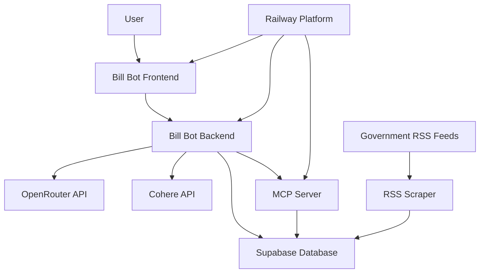
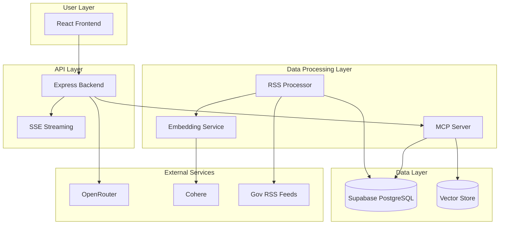
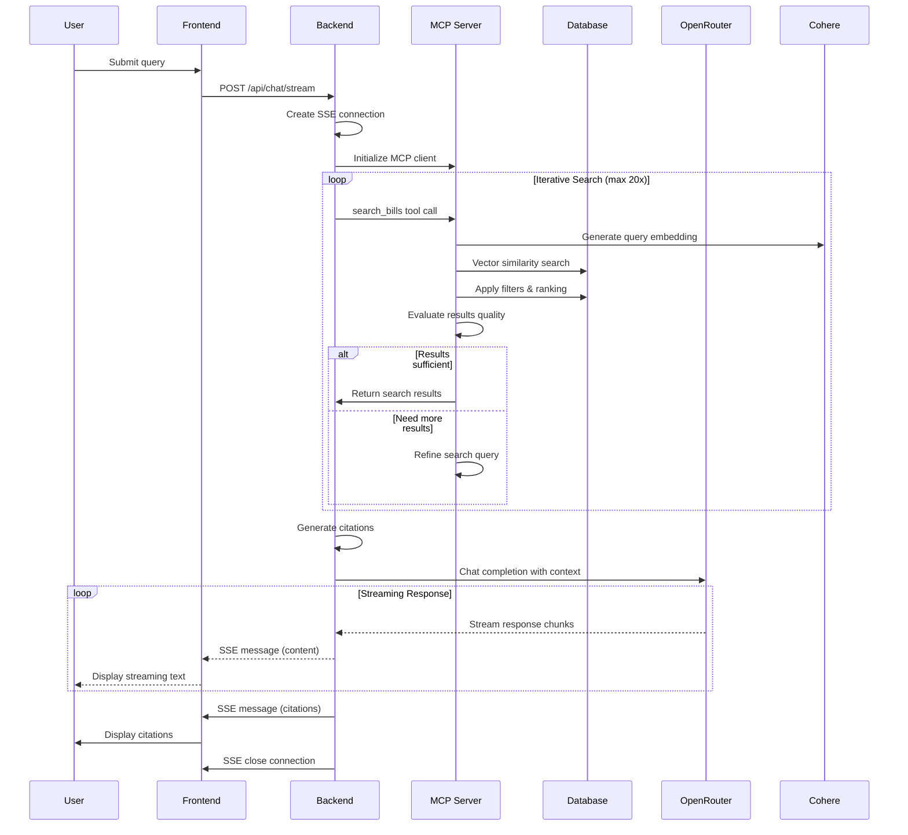
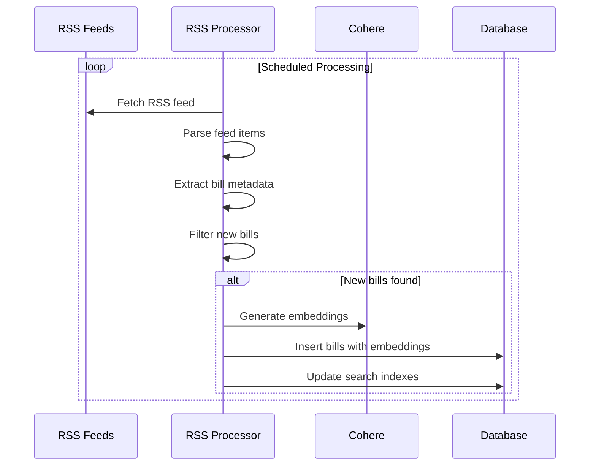
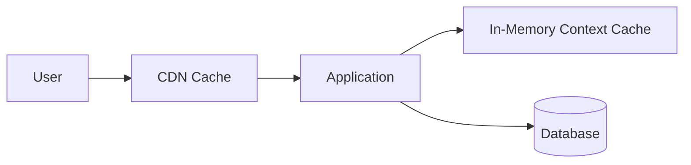

# System Architecture Design

## Executive Summary

Bill Bot is architected as a modern, scalable RAG-based chatbot system designed for exploring legislative bills. The system follows a microservices pattern with clear separation between frontend, backend, MCP server, and database components. The architecture emphasizes real-time streaming, vector-based semantic search, and iterative data retrieval through the Model Context Protocol.

## System Context

### External Dependencies



### System Boundaries

- **Internal Components**: Frontend, Backend API, MCP Server, Database
- **External Services**: OpenRouter LLM API, Cohere Embeddings, Government RSS Feeds
- **Infrastructure**: Railway deployment platform, Supabase hosted database
- **User Interface**: Web-based chat interface with real-time streaming

## Component Architecture

### High-Level Component Diagram



### Component Responsibilities

#### Frontend (React + TypeScript)
- **Primary Function**: User interface for chat interactions
- **Key Features**:
  - Real-time streaming chat interface
  - Citation display and management
  - Tool call feedback accordion
  - Responsive design with dark mode
- **Technology Stack**: React 19, TypeScript, Vite, shadcn/ui, Tailwind CSS v4
- **Communication**: REST API calls and SSE streaming with backend

#### Backend API (Node.js + Express)
- **Primary Function**: Orchestrate chat sessions and coordinate services
- **Key Features**:
  - Chat endpoint for user queries
  - SSE streaming for real-time responses
  - MCP client integration
  - OpenRouter LLM integration
  - Rate limiting and security
- **Technology Stack**: Node.js, Express, TypeScript
- **Communication**: HTTP REST, SSE, MCP protocol

#### MCP Server
- **Primary Function**: Database access layer with iterative search capabilities
- **Key Features**:
  - Tool-based database operations
  - Vector similarity search
  - Iterative search refinement (max 20 iterations)
  - Citation generation
- **Technology Stack**: TypeScript, MCP SDK
- **Communication**: MCP protocol over stdio/HTTP

#### Database Layer (Supabase)
- **Primary Function**: Persistent storage and vector search
- **Key Features**:
  - Bills metadata storage
  - Vector embeddings storage
  - Full-text search indexes
  - Real-time subscriptions
- **Technology Stack**: PostgreSQL with pgvector extension
- **Communication**: PostgreSQL protocol, REST API

#### RSS Processing Service
- **Primary Function**: Automated bill data ingestion
- **Key Features**:
  - Multi-source RSS feed parsing
  - Bill data extraction and normalization
  - Automatic embedding generation
  - Scheduled processing
- **Technology Stack**: Node.js, rss-parser
- **Communication**: HTTP for RSS feeds, direct database access

## Data Flow Architecture

### User Query Processing Flow



### RSS Data Ingestion Flow



## Technology Integration Patterns

### MCP Protocol Implementation

The Model Context Protocol serves as the bridge between the LLM and database, enabling iterative search capabilities:

```typescript
// MCP Tool Definition Pattern
interface BillSearchTool {
  name: "search_bills";
  description: "Search legislative bills with iterative refinement";
  inputSchema: {
    query: string;
    filters?: SearchFilters;
    iteration?: number;
  };
  outputSchema: {
    results: Bill[];
    searchMetadata: SearchMetadata;
    needsRefinement: boolean;
  };
}
```

### Real-time Streaming Pattern

Server-Sent Events provide real-time updates to the frontend:

```typescript
// SSE Message Types
type SSEMessage = 
  | { type: 'start'; data: { sessionId: string } }
  | { type: 'content'; data: { content: string } }
  | { type: 'tool_call'; data: { tool: string; args: any } }
  | { type: 'citation'; data: Citation }
  | { type: 'error'; data: { error: string } }
  | { type: 'end'; data: { status: 'completed' | 'error' } };
```

### Vector Search Integration

Hybrid search combining semantic and keyword approaches:

```sql
-- Hybrid Search Function
SELECT 
  b.*,
  (semantic_score * 0.7 + keyword_score * 0.3) as combined_score
FROM (
  -- Semantic search using vector similarity
  SELECT *, (1 - (embedding <=> query_embedding)) as semantic_score
  FROM bills
  WHERE (1 - (embedding <=> query_embedding)) > threshold
) b
LEFT JOIN (
  -- Keyword search using full-text
  SELECT id, ts_rank(search_vector, query) as keyword_score
  FROM bills 
  WHERE search_vector @@ query
) k ON b.id = k.id
ORDER BY combined_score DESC;
```

## Security Architecture

### Authentication & Authorization
- **API Security**: Rate limiting, CORS configuration, input validation
- **Database Security**: Row-level security, service role authentication
- **Environment Security**: Encrypted environment variables, secret management

### Data Protection
- **Encryption**: TLS in transit, encrypted storage for sensitive data
- **Privacy**: No user data persistence, stateless chat sessions
- **Compliance**: Government data handling best practices

## Performance Architecture

### Caching Strategy


### Scaling Considerations
- **Horizontal Scaling**: Stateless API servers, load balancing
- **Database Optimization**: Vector index tuning, connection pooling
- **Context Caching**: In-memory context data caching (sponsors, topics, statuses)
- **CDN Integration**: Static asset delivery for frontend

## Deployment Architecture

### Monorepo Structure
```
bill-bot/
├── frontend/           # React application
├── backend/           # Express API server
├── mcp-server/        # MCP protocol server
├── shared/            # Common types and utilities
├── config/            # YAML configuration files
├── migrations/        # Database migrations
└── docker/            # Docker configurations
```

### Railway Deployment Pattern
- **Frontend Service**: Nginx-served React build
- **Backend Service**: Node.js API with health checks
- **MCP Service**: Standalone MCP server
- **Database**: Managed Supabase PostgreSQL
- **Environment**: Production-ready configuration

## Error Handling & Monitoring

### Error Boundaries
- **Frontend**: React error boundaries for component failures
- **Backend**: Global error handlers with proper HTTP status codes
- **MCP**: Graceful tool call failures with retry strategies
- **Database**: Connection retry logic and timeout handling

### Monitoring Strategy
- **Health Checks**: Service availability endpoints
- **Logging**: Structured logging with correlation IDs
- **Metrics**: Performance tracking and alerting
- **Tracing**: Request flow tracking across services

## API Design Principles

### RESTful Endpoints
```typescript
// Core API Structure
interface APIEndpoints {
  'POST /api/chat/stream': StreamingChatSession;
  'GET /api/health': HealthStatus;
  'GET /api/bills/search': BillSearchResults;
  'POST /api/admin/feeds/refresh': FeedRefreshStatus;
}
```

### Response Patterns
- **Streaming**: SSE for real-time chat responses
- **Synchronous**: REST for metadata and search operations
- **Error Handling**: Consistent error response format
- **Rate Limiting**: Progressive rate limiting with clear headers

## Configuration Management

### YAML-Based Configuration
```yaml
# Environment-specific configuration
app:
  name: "Bill Bot"
  environment: "production"

models:
  llm: "anthropic/claude-sonnet-4"

features:
  iterativeSearch: true
  maxIterations: 20
  citationGeneration: true
  realTimeStreaming: true
```

### Environment Variable Integration
- **Development**: Local .env files
- **Production**: Railway environment variables
- **Security**: Encrypted secrets for API keys
- **Validation**: Schema validation on startup

## Risk Mitigation

### Technical Risks
- **API Rate Limits**: Fallback models, request queuing
- **Database Performance**: Connection pooling, query optimization
- **Streaming Failures**: Reconnection logic, graceful degradation
- **Security Vulnerabilities**: Regular updates, security scanning

### Operational Risks
- **Service Availability**: Health checks, auto-scaling
- **Data Quality**: RSS feed validation, data normalization
- **Performance Degradation**: Monitoring and alerting
- **Configuration Errors**: Validation and rollback procedures

## Implementation Guidelines

### Development Workflow
1. **Local Development**: Docker Compose for full stack
2. **Component Testing**: Individual service testing
3. **Integration Testing**: End-to-end workflow validation
4. **Deployment**: Automated CI/CD pipeline

### Code Organization
- **Modular Architecture**: Clear separation of concerns
- **Type Safety**: TypeScript throughout the stack
- **Error Handling**: Comprehensive error boundaries
- **Documentation**: Inline documentation and API specs

This architecture provides a robust foundation for implementing Bill Bot with clear separation of concerns, scalable design patterns, and comprehensive error handling. The modular approach enables independent development and deployment of components while maintaining system cohesion through well-defined interfaces.